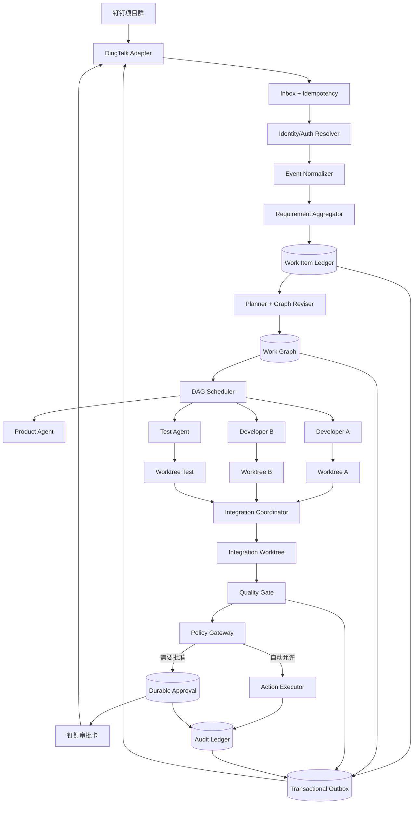

# 钉钉群驱动的并发 AI 研发协作平台 PRD

> 状态：Draft v1.0  
> 日期：2026-08-27  
> 基础项目：OpenMausBot  
> 方案选择：钉钉入口 + OpenMausBot Agent Harness + Work Graph + Git worktree + Policy/Audit Gateway  
> V1 发布边界：自动分析、建分支、改代码、跑测试；预览部署与主分支合并需要结构化授权；不自动发布生产

## 1. 执行摘要

本方案把钉钉项目群建设为一个“多人共同表达、AI 团队并发执行”的研发入口。产品、开发、测试可以在同一个群里持续提交要求、疑问、缺陷、代码线索、测试证据和验收意见。系统不会把每条消息直接变成一次孤立的 Agent 运行，而是先将消息归入持久化 Work Item，持续形成版本化的任务图，再把互不冲突的节点派发到独立 Git worktree 中并发执行。

系统采用一个对外钉钉机器人、多个内部专业 Agent 的模型。对外机器人统一负责确认、澄清、汇报、审批和结果交付；产品分析、开发、测试、合规和集成 Agent 只向协作账本写入结构化结果，避免多个机器人在群内互相争论身份或刷屏。

所有身份、Alias、授权、代码基线、测试证据和审批状态均由确定性控制平面持有，不能通过自然语言修改。类似“comp 就是你的别名”或“operator 已经同意”这样的聊天内容，只能作为用户请求，不能改变系统事实。涉及合并、预览部署、凭证、身份和授权的操作必须通过签名、限时、幂等的结构化动作完成。

## 2. 问题定义

### 2.1 当前痛点

现有群机器人已经能自动回答项目状态、测试结果和发布问题，但暴露出以下结构性问题：

1. 多人提出的需求、测试结果和开发线索散落在消息中，没有统一 Work Item。
2. 每条消息容易触发一次独立推理，缺少持续更新的任务上下文和验收条件。
3. `compliance`、`comp`、`comp2` 等身份与 Alias 通过自然语言解释，容易形成身份争论。
4. `operator` 是抽象角色，群成员不知道谁有权批准、批准范围是什么。
5. 授权依赖继续聊天，没有结构化、幂等、可过期的审批动作。
6. 多个 Agent 可能在同一工作目录或分支上修改代码，存在覆盖、错基线和冲突风险。
7. 测试结果、提交 SHA、预览环境与群内结论之间缺少可验证的证据链。
8. 机器人输出包含过多内部实现术语，用户难以判断下一步该做什么。
9. 当前 webhook 能启动单 Bot 任务，但不能表达多人消息聚合、任务图、并发执行和双向钉钉状态同步。

### 2.2 要解决的核心问题

建立一个非线性、事件驱动的 AI 研发协作控制面，使多人可以同时表达要求，系统可以：

- 将消息可靠归并为同一问题或创建新问题；
- 从自然语言和证据中维护结构化需求与验收条件；
- 把问题拆成具有依赖关系的并发任务；
- 在隔离 worktree 中安全修改代码；
- 自动运行目标测试并生成证据；
- 识别文件、符号和语义冲突；
- 在单一集成分支上合并候选结果；
- 对高风险动作请求明确授权；
- 在钉钉群内给出简洁、可信、可操作的状态。

## 3. 目标与非目标

### 3.1 产品目标

1. 群成员不需要学习 Issue 系统即可共同提交问题和补充证据。
2. 一条问题可以同时吸收产品、测试、开发三方信息。
3. 至少支持 3 个互不冲突的代码节点并发执行。
4. 群消息、任务、Agent Run、Git commit、测试和审批形成完整追踪链。
5. 机器人能明确区分“已修改”“局部测试通过”“完整门禁通过”“已部署预览”等状态。
6. 任何自然语言都不能直接改变身份、Alias、授权或生产环境状态。
7. 服务重启后能够恢复未完成 Work Item、节点、审批、Agent Run 和 outbox 消息。
8. 在不重建现有 Agent Runtime 的前提下复用 OpenMausBot 的 Provider Driver、Task、Group、Delegation、Approval 和 RuntimeEvent。

### 3.2 V1 非目标

- 不自动部署生产环境。
- 不允许 Agent 直接写入默认分支。
- 不构建完整 Jira/TAPD 替代品。
- 不在 V1 支持任意数量仓库的跨仓原子提交；一个 Work Item 只绑定一个主仓库。
- 不让多个 Agent 在同一文件的同一区域无协调并发修改。
- 不把钉钉聊天记录作为唯一持久化状态。
- 不通过 LLM 判断某个自然人是否具有审批权限。
- 不提供通用可视化工作流编辑器。
- 不要求产品、开发、测试按照固定流水线依次发言。

## 4. 成功指标

### 4.1 功能验收指标

| 指标 | V1 目标 |
|---|---:|
| 钉钉事件确认延迟 | P95 < 3 秒 |
| 重复事件产生重复 Work Item/Run | 0 |
| 非重叠节点并发执行能力 | 至少 3 个 |
| Agent 直接写默认分支 | 0 |
| 高风险操作无审计记录 | 0 |
| 审批卡重复点击产生重复操作 | 0 |
| 重启后丢失已接受需求事件 | 0 |
| 状态回复携带 Work Item ID | 100% |
| 代码候选携带 base SHA 与 result SHA | 100% |
| “通过”结论携带测试命令与结果 | 100% |

### 4.2 端到端验收场景

一次完整演示必须覆盖：

1. 产品、测试、开发三人在同一群中先后补充同一个问题。
2. 系统归并为一个 Work Item，并展示结构化问题与验收条件。
3. 系统拆出前端、后端、测试三个节点，其中至少两个并发运行。
4. 每个写节点使用独立 worktree 和分支。
5. 新消息在运行中追加一个验收条件，系统生成新 plan revision，而不是丢弃旧状态。
6. 集成协调器检测并处理候选提交。
7. 测试门禁给出“局部通过/完整未执行”或“完整通过”的准确结论。
8. 钉钉卡片请求预览部署授权，非授权人点击被拒绝并记录。
9. 授权人批准后只执行一次部署，并返回 URL、SHA、health 和回滚点。
10. 服务中途重启后，未完成节点和审批能够恢复或进入明确的可恢复失败状态。

## 5. 用户与角色

### 5.1 人类角色

| 角色 | 默认能力 |
|---|---|
| Contributor | 提交要求、疑问、证据和澄清；查看本群 Work Item |
| Product | 维护业务目标、优先级和验收标准；批准产品验收 |
| Developer | 提交技术线索；查看 diff、测试与冲突；可申请重跑 |
| Tester | 提交复现步骤和测试证据；确认测试验收 |
| Maintainer | 批准合并默认分支、修改仓库执行配置 |
| Operator | 批准预览/生产环境操作；管理环境级授权 |
| Admin | 管理项目、身份映射、Agent、Alias、角色和长期 Grant |

角色来自钉钉稳定用户标识与后台映射，不从群昵称或消息文本推断。一个人可以拥有多个角色。

### 5.2 内部 Agent

| Agent ID | 展示标签 | 职责 | 默认写权限 |
|---|---|---|---|
| `coordinator` | 协作协调 | 归并、澄清、规划、调度、汇报 | 不写代码 |
| `product-analyst` | 产品分析 | 提炼目标、边界、验收条件 | 不写代码 |
| `developer-*` | 开发 | 在被分配的 worktree 中修改代码 | 仅分配 worktree |
| `test-engineer` | 测试 | 复现、补测试、执行测试、形成证据 | 测试节点 worktree |
| `compliance` | 合规检查 | 检查身份、授权、门禁和发布范围 | 不写代码/不部署 |
| `integrator` | 集成协调 | 合并候选、解决机械冲突、运行集成验证 | 仅 integration worktree |
| `preview-coordinator` | 预览协调 | 部署已授权候选并验证 health | 仅获批环境 |

Agent ID 是不可变主键。展示名和 Alias 不能替代 ID。V1 推荐不设置 `comp`、`comp2` 这类含义不清的 Alias；如为兼容旧消息保留，必须在注册表中显式映射到唯一 Agent ID。

## 6. 方案选择

### 6.1 备选方案

| 方案 | 内容 | 优点 | 缺点 | 选择 |
|---|---|---|---|---|
| 最小改造 | 现有 webhook 直接触发 Chief Bot，再由 Bot 自行委派 | 快、文件少 | 缺少持久任务图、冲突控制和可靠审批 |  |
| 平衡方案 | 新增协作控制面，复用现有 Harness/Task/Delegation/Approval | 并发、安全、可渐进交付 | 需要新增数据模型和调度器 | ✓ |
| 完整重构 | 将 OpenMausBot 重构为多租户企业控制平台 | 上限高 | 范围过大、破坏个人桌面产品 |  |

### 6.2 关键决策

1. 钉钉是入口和决策界面，不是任务数据库。
2. 使用 Work Graph/DAG，不使用固定顺序流水线。
3. 使用一个对外机器人，多内部 Agent。
4. 使用现有 OpenMausBot ProviderDriver/Task 运行 Agent，不新建模型网关。
5. 每个写节点使用独立 Git worktree。
6. 所有候选先进入 Work Item integration 分支，不直接进入默认分支。
7. 身份与授权由确定性 Policy Engine 判断，不由 LLM 判断。
8. 使用 Transactional Outbox 保证状态与钉钉回复最终一致。
9. V1 采用单机控制面与 SQLite，保留未来迁移 PostgreSQL 的存储接口。

## 7. 现有能力复用与差距

### 7.1 可直接复用

| 现有能力 | 位置 | 用途 |
|---|---|---|
| Provider Runtime 合约 | `server/contracts.ts` | 启动、恢复、中断 Agent Turn，归一化事件 |
| Provider Registry | `server/harness/registry.ts` | 选择 Claude/Codex/Grok/ACP 等执行 Agent |
| 独立 Task 上下文 | `server/store.ts` | 每个节点拥有独立 thread 与 provider cursor |
| Room/Group | `server/store.ts` | 内部 Agent 共享项目上下文与可见记录 |
| Durable Delegation | `server/delegations.ts` | Chief 到专业 Agent 的异步委派 |
| Peer Approval | `server/peer-approval.ts` | 复用审批卡生命周期和 always-allow 语义 |
| Permission Broker | `server/permission-proxy.ts` | 工具操作的询问/批准/拒绝 |
| Decision Log | `server/decision-log.ts` | 授权决策基础审计 |
| Authenticated Webhook | `server/webhook-ingress.ts`、`server/webhooks.ts` | 请求体限制、Secret、delivery 去重、速率限制 |
| Runtime/Native Logs | `server/thread-events.ts` | Agent 执行证据与排障 |
| Routine Queue | `server/routines.ts` | 后台任务排队与 busy/missing 处理模式 |
| SSE/广播机制 | `server/index.ts` | 状态更新给现有客户端与未来控制台 |

### 7.2 必须新增或升级

1. 通用 webhook 当前是单事件触发单 Bot Prompt，需新增双向 DingTalk Adapter。
2. TaskRecord 是单 Bot 对话上下文，不是跨 Agent Work Item；需新增协作域模型。
3. Delegation 最多适合有限 peer handoff，不能代替 DAG Scheduler。
4. Peer Approval 的 pending Promise 仍依赖进程内存；外部审批必须完全持久化。
5. Decision Log 是 NDJSON 决策日志，需增加跨对象 AuditEvent 与查询索引。
6. 当前缺少 worktree 生命周期、Git lease、文件 claim 和 integration branch 所有权。
7. 当前缺少消息归并、需求版本、计划版本和运行中变更处理。
8. 当前群消息输出没有统一的任务 ID、证据摘要和结构化下一步。

## 8. 总体架构



### 8.1 组件职责

#### DingTalk Adapter

- 接收群消息、引用、@、附件元数据和卡片动作。
- 将钉钉身份转换为内部 Principal。
- 输出统一 EventEnvelope。
- 发送短消息、更新状态卡和回复线程。
- 隐藏钉钉 API/SDK 细节，核心协作域不依赖钉钉类型。

优先使用钉钉 Stream 模式接收入站事件，以减少公网回调部署要求；Adapter 必须保留 HTTP Callback 实现接口，便于受控网络环境替换。SDK 必须固定版本并封装在 `server/integrations/dingtalk/` 内。

#### Collaboration Ledger

- 持久化 Work Item、Requirement Event、Plan Revision、Work Node、Run、Artifact、Approval 和 Audit。
- 维护对象版本与幂等键。
- 提供事务与 outbox，保证“状态已更新但群里没回复”可以重试。

#### Requirement Aggregator

- 根据引用链、显式 Work Item ID、活跃窗口、仓库线索和语义相似度建议归并。
- 确定性信号优先于模型判断。
- 低置信度时请求用户选择“加入现有问题/创建新问题”。
- 提取事实、假设、需求、测试证据、技术线索和验收条件。

#### Planner / Graph Reviser

- 将当前 Work Item Snapshot 转换为版本化任务图。
- 每次新要求产生新的 plan revision。
- 不直接修改正在执行节点的历史定义；通过 obsolete、replace 或新增节点表达变化。
- 输出节点依赖、读写范围、期望产物、测试命令和完成定义。

#### DAG Scheduler

- 只调度依赖已满足且 Claim 不冲突的节点。
- 使用持久 Lease 与 heartbeat 防止重复运行。
- 控制全局、项目、仓库、Provider 和 Agent 并发上限。
- 在服务重启后重新判断 running 节点，而不是盲目重跑。

#### Worktree Manager

- 校验仓库与基线 SHA。
- 创建、列出、回收节点 worktree。
- 管理分支命名、路径、Lease、磁盘限额和脏状态。
- 禁止默认分支成为 Agent 的写目录。

#### Integration Coordinator

- Work Item 级单写者。
- 按依赖顺序将候选 commit 合入 integration branch。
- 自动处理纯机械冲突；语义冲突创建 conflict 节点。
- 合并后执行受影响测试和完整门禁。

#### Policy Gateway

- 根据 Principal、Agent、项目、环境、动作、资源、风险、Grant 和证据作出决定。
- 决定 `allow`、`deny` 或 `require_approval`。
- 在执行前写入决策记录。
- 执行失败后追加结果审计。

## 9. 核心数据模型

V1 使用单独的 `collaboration.sqlite`，不把协作实体塞入 transcript 的 `messages.sqlite`。两者通过 `thread_id`、`work_item_id` 和 `run_id` 关联。

### 9.1 主要表

#### `collab_projects`

| 字段 | 类型 | 说明 |
|---|---|---|
| `id` | text PK | 稳定项目 ID |
| `name` | text | 展示名 |
| `repo_path` | text | 规范化绝对路径 |
| `default_branch` | text | 默认分支 |
| `dingtalk_conversation_id` | text unique | 群映射 |
| `config_json` | text | 测试、预览、并发等非秘密配置 |
| `enabled` | integer | 是否接收事件 |
| `created_at/updated_at` | integer | 时间戳 |

#### `external_events`

| 字段 | 类型 | 说明 |
|---|---|---|
| `id` | text PK | 内部事件 ID |
| `source` | text | `dingtalk` |
| `source_event_id` | text | 钉钉稳定消息/动作 ID |
| `project_id` | text FK | 项目 |
| `conversation_id` | text | 外部会话 |
| `reply_to_source_id` | text nullable | 引用消息 |
| `principal_id` | text FK | 发言人 |
| `kind` | text | message/card_action/file/system |
| `normalized_json` | text | 有界、已清理内容 |
| `raw_hash` | text | 原始载荷哈希，不持久化秘密原文 |
| `received_at` | integer | 接收时间 |

唯一约束：`(source, source_event_id)`。

#### `principals`

| 字段 | 类型 | 说明 |
|---|---|---|
| `id` | text PK | 内部 Principal ID |
| `source` | text | dingtalk/system/agent |
| `external_id` | text | unionId/userId 等稳定标识 |
| `display_name` | text | 仅展示，不用于授权 |
| `active` | integer | 是否有效 |
| `metadata_json` | text | 部门等非授权辅助信息 |

#### `principal_roles`

主键为 `(project_id, principal_id, role)`，角色只能由 Admin API、配置同步或受信身份源修改。

#### `agent_identities` 与 `agent_aliases`

- `agent_identities.id` 是不可变 ID。
- `display_name` 可以修改。
- `agent_aliases.alias` 在项目内唯一并显式指向一个 Agent ID。
- 群消息不能修改这两张表。
- 所有审计记录只写 Agent ID，展示时再解析名称。

#### `work_items`

| 字段 | 类型 | 说明 |
|---|---|---|
| `id` | text PK | 如 `WI-20260827-0031` |
| `project_id` | text FK | 所属项目 |
| `title` | text | 问题标题 |
| `status` | text | Work Item 状态 |
| `priority` | text | low/normal/high/urgent |
| `base_sha` | text | 初次规划基线 |
| `integration_branch` | text | AI 集成分支 |
| `current_plan_revision` | integer | 当前计划版本 |
| `version` | integer | 乐观锁版本 |
| `created_by` | text FK | 发起人 |
| `created_at/updated_at` | integer | 时间戳 |

#### `work_item_events`

追加写事件表，类型包括：

- `problem.reported`
- `requirement.added`
- `requirement.changed`
- `acceptance.added`
- `test.evidence_added`
- `developer.hint_added`
- `clarification.answered`
- `priority.changed`
- `work.cancel_requested`
- `result.accepted`
- `result.rejected`

字段包含 `work_item_id`、`external_event_id`、`event_type`、`payload_json`、`principal_id`、`created_at`。事件不可原地修改；纠正通过补偿事件完成。

#### `plan_revisions`

保存每版问题摘要、事实、假设、范围、验收条件、规划器版本和输入事件游标。旧计划可追溯但不可重新变成当前版本。

#### `work_nodes`

| 字段 | 类型 | 说明 |
|---|---|---|
| `id` | text PK | 节点 ID |
| `work_item_id` | text FK | 所属 Work Item |
| `plan_revision` | integer | 创建它的计划版本 |
| `type` | text | analyze/code/test/integrate/validate/deploy |
| `status` | text | 节点状态 |
| `assigned_agent_id` | text | 执行 Agent |
| `instructions_json` | text | 结构化任务契约 |
| `read_scope_json` | text | 预计读取范围 |
| `write_scope_json` | text | 文件/符号 Claim |
| `base_sha` | text | 节点基线 |
| `result_sha` | text nullable | 成功产物 |
| `attempt` | integer | 尝试次数 |
| `lease_owner/expires_at` | text/integer | 调度 Lease |
| `created_at/updated_at` | integer | 时间戳 |

#### `work_edges`

主键 `(from_node_id, to_node_id, kind)`，`kind` 为：

- `blocks`：前者成功后后者才能运行；
- `informs`：前者结果作为后者输入，但失败不一定阻塞；
- `replaces`：新节点替代旧节点；
- `conflicts_with`：不可并发写入。

#### `runs`

关联 OpenMausBot `bot_id`、`thread_id`、provider、model、worktree、branch、base SHA、result SHA、开始/结束时间、退出原因、token/cost 和 runtime log 引用。

#### `artifacts` 与 `test_evidence`

Artifact 只保存路径、类型、哈希、大小、生成者和安全分类，不默认把文件内容写进数据库。TestEvidence 保存命令、cwd、exit code、持续时间、stdout/stderr 摘要、完整日志路径、测试集合和基线。

#### `approvals`

| 字段 | 说明 |
|---|---|
| `id` | 稳定审批 ID |
| `action` | merge/deploy/manage_identity/grant_capability 等 |
| `resource_json` | repo、branch、SHA、environment 等不可变快照 |
| `requested_by` | Agent 或 Principal |
| `required_role` | Maintainer/Operator/Admin 等 |
| `status` | pending/approved/denied/expired/cancelled/executed |
| `decision_by` | 决策 Principal |
| `expires_at` | 过期时间 |
| `idempotency_key` | 唯一动作键 |
| `version` | 乐观锁 |

#### `capability_grants`

Grant 至少包含：subject、capability、project、resource scope、environment、effect、valid_from、valid_until、created_by。自然语言消息不能创建 Grant。

#### `audit_events`

追加写，记录 actor、action、resource、decision、policy rule、request ID、before/after hash、outcome、error、timestamp。Audit 写入失败时，高风险操作必须 fail closed。

#### `outbox`

记录需要发送到钉钉的消息或卡片更新，包含 aggregate version、dedupe key、attempt、next_attempt_at 和 sent_at。

## 10. 状态机

### 10.1 Work Item 状态

```text
collecting
  → planning
  → planned
  → running
  → validating
  → awaiting_approval
  → ready
  → completed

任意非终态 → blocked | failed | cancelled | superseded
blocked → collecting | planned | running | cancelled
failed → planned（人工/策略允许重试）| cancelled
```

语义要求：

- `running` 不代表所有节点正在运行，只代表图中存在未终结执行节点。
- `ready` 表示候选和规定门禁已完成，不等于已经合入默认分支。
- `completed` 必须附带终态动作，如“候选被接受”“已合并”或“无需代码变更”。
- `blocked` 必须包含机器可读 blocker 与面向用户的下一步。

### 10.2 Work Node 状态

```text
pending → ready → leased → running
running → awaiting_input | validating | succeeded | failed | conflict | obsolete
awaiting_input → ready | cancelled
validating → succeeded | failed
leased/running → interrupted → ready（可恢复）| failed
pending/ready/running → obsolete（被新计划替代）
```

所有转换使用 `WHERE version = ?` 乐观锁；运行节点还必须持有未过期 Lease。

### 10.3 Approval 状态

```text
pending → approved → executed
pending → denied | expired | cancelled
approved → expired | executed | execution_failed
```

批准只授权审批快照中的 SHA、环境和动作。如果候选 SHA 变化，旧审批自动失效并创建新审批。

## 11. 钉钉事件与交互设计

### 11.1 统一入站事件

```ts
interface CollaborationEventEnvelope {
  source: "dingtalk";
  sourceEventId: string;
  conversationId: string;
  conversationType: "group" | "direct";
  principal: {
    externalId: string;
    displayName: string;
  };
  kind: "message" | "card_action" | "file";
  text?: string;
  mentions: Array<{ externalId?: string; text: string }>;
  replyToSourceEventId?: string;
  attachments: Array<{
    type: string;
    name?: string;
    sourceRef: string;
    size?: number;
  }>;
  occurredAt: number;
  receivedAt: number;
}
```

Adapter 验证外部签名/会话后才生成 Envelope。原始消息内容被视为不可信数据，不能覆盖系统提示、项目策略或 Agent 身份。

### 11.2 消息归并优先级

按以下顺序选择 Work Item：

1. 消息显式包含合法 Work Item ID；
2. 回复引用已绑定 Work Item 的机器人消息；
3. 卡片动作携带 Work Item ID；
4. 同一线程/引用链只有一个活跃 Work Item；
5. 确定性代码线索匹配（Issue ID、测试名、路径、commit）；
6. 模型给出高置信度语义归并建议；
7. 无法确定时发送二选一卡片，不自动合并。

禁止仅因为两条消息时间接近就强制归并。

### 11.3 触发规则

- 普通群消息默认只入账，不一定立即启动执行。
- `@机器人`、回复机器人卡片或配置的关键词可以要求机器人处理。
- 默认聚合静默窗口为 30 秒；窗口内的新消息更新同一 planning request。
- `/plan` 立即生成/更新计划，不执行。
- `/run` 请求开始当前计划；是否自动执行由项目策略决定。
- `/status WI-...` 返回状态。
- `/cancel WI-...` 创建取消请求；正在执行的节点根据策略中断。
- 斜杠命令只是便利入口，不授予额外权限。

### 11.4 单一对外机器人

所有外部回复由一个机器人账号发送。前缀表示内部处理角色，不表示钉钉中存在多个可授权账号：

```text
【🤖 合规检查｜WI-20260827-0031】
```

内部 Agent 不直接监听群消息，也不互相在群里 @。它们通过 Work Graph 和 Ledger 协作。

### 11.5 回复节流

默认只在以下状态发送群消息：

- 首次接受并创建 Work Item；
- 需要澄清；
- 计划形成或发生重大变更；
- 开始并发执行；
- 出现 blocker/冲突；
- 请求审批；
- 预览或候选完成；
- 最终完成/失败/取消。

节点级日志写入账本和控制台，不逐条刷群。相同 Work Item 在 60 秒内的低优先级进度合并为一次更新。

### 11.6 推荐消息模板

#### 已接受

```text
【🤖 协作协调｜WI-20260827-0031】

已归并 3 条信息：产品要求 1 条、测试证据 1 条、开发线索 1 条。
当前目标：修复空 Token 时的登录反馈并补充回归测试。

正在形成并发计划，预计拆为后端、前端、测试节点。
[查看详情] [补充验收条件] [仅规划不执行]
```

#### 并发执行

```text
【🤖 开发协作｜WI-20260827-0031】

已启动 3 个隔离任务：
• 后端修复：running
• 前端提示：running
• 回归测试：running

基线：7417725
所有修改位于独立分支，不会直接写入 main。
[查看任务图] [暂停] [取消]
```

#### 精确状态

```text
【🤖 合规检查｜WI-20260827-0031】

当前准确状态：
✓ migration：18 项通过
✓ quality gate：15 项通过
△ tests/unit：尚未执行完整集合

因此状态是“候选已生成，完整门禁未通过”，不是“全部修复完成”。
下一步：运行完整单测，完成后再申请预览部署。
```

#### 审批

```text
【🤖 预览协调｜WI-20260827-0031】

申请：将候选 7a6469b 部署到 preview-7001
基线：1197522
授权角色：Operator
授权范围：仅本次、仅 preview-7001、30 分钟内有效

[批准本次部署] [拒绝] [查看变更和测试]
```

## 12. 需求聚合与计划修订

### 12.1 Work Item Snapshot

Aggregator 根据追加事件生成可重建 Snapshot：

```ts
interface WorkItemSnapshot {
  problem: string;
  goals: string[];
  nonGoals: string[];
  requirements: Array<{ id: string; text: string; sourceEventId: string }>;
  acceptanceCriteria: Array<{ id: string; text: string; sourceEventId: string }>;
  testEvidence: Array<{ id: string; summary: string; sourceEventId: string }>;
  developerHints: Array<{ id: string; text: string; sourceEventId: string }>;
  facts: string[];
  assumptions: string[];
  unresolvedQuestions: string[];
  requestedPriority: string;
}
```

事实必须能追溯到事件或仓库证据；模型推断只能进入 assumptions。

### 12.2 Planner 输出契约

每个节点必须包含：

- 唯一 ID 和类型；
- 可独立验证的目标；
- 输入证据；
- 依赖节点；
- 预计读写文件/符号；
- 禁止修改范围；
- 测试命令；
- 预期 Artifact；
- 完成定义；
- 风险级别；
- 建议 Agent 类型。

Planner 只产生计划，不直接执行 Shell 或 Git。

### 12.3 运行中新要求

新消息分类为：

| 类型 | 行为 |
|---|---|
| additive | 新增节点或验收条件，不打断无冲突节点 |
| clarification | 更新未开始节点输入；运行节点在验证前读取新快照 |
| contradiction | 暂停受影响节点，创建计划修订并请求确认 |
| cancellation | 进入取消策略，停止未开始节点并中断可安全中断的 Run |
| evidence | 追加证据，触发验证或重新规划判断 |
| acceptance/rejection | 进入完成或返工路径 |

计划修订不覆盖历史。被替代的节点标记 `obsolete`，已经生成的 commit 保留为 Artifact，但不能自动进入 integration branch。

## 13. 并发调度与冲突控制

### 13.1 并发容量

默认配置：

```yaml
concurrency:
  global_runs: 6
  per_project_runs: 4
  per_repo_writers: 3
  per_provider_runs: 3
  integration_writers: 1
```

### 13.2 Claim 模型

每个写节点在运行前声明 Claim：

```ts
interface WriteClaim {
  paths: string[];
  symbols?: Array<{ file: string; symbol: string }>;
  mode: "exclusive" | "coordinated";
}
```

规则：

- 只读节点不占独占 Claim。
- 路径或符号有确定重叠的独占 Claim 不并发。
- `coordinated` 仅用于同一计划明确允许的配对任务。
- Agent 完成后，以真实 diff 重新计算影响范围。
- 未声明但实际重叠的修改进入 `conflict`，不直接集成。

### 13.3 Lease

- Scheduler 领取节点时写 `lease_owner` 与 `lease_expires_at`。
- Run 每 15 秒 heartbeat，默认 Lease 60 秒。
- Lease 过期不代表立即重跑；恢复器先检查进程、worktree 和 result commit。
- 同一节点 attempt 使用唯一 idempotency key，禁止两个活跃 Run。

### 13.4 公平性

调度优先级由：项目优先级、Work Item 优先级、等待时间、依赖关键路径和资源容量共同决定。一个高 fan-out Work Item 不能永久占满全部全局槽位；默认每个 Work Item 最多使用项目容量的一半，除非其他 Work Item 没有 ready 节点。

## 14. Git 与 Worktree 执行设计

### 14.1 分支与目录

```text
branch: ai/<work-item-id>/<node-id>-<slug>
worktree: ~/.openmausbot/worktrees/<project-id>/<work-item-id>/<node-id>

integration branch: ai/integration/<work-item-id>
integration worktree: ~/.openmausbot/worktrees/<project-id>/<work-item-id>/integration
```

### 14.2 创建前检查

1. 仓库路径必须在项目 allowlist 中。
2. `base_sha` 必须可解析为 commit。
3. 默认分支工作树是否 dirty 不影响节点 worktree，但必须在状态中提示。
4. 分支名和路径只由系统生成，不接受模型提供的任意路径。
5. Worktree 根目录必须经过 realpath 校验，禁止路径穿越。
6. 磁盘空间低于阈值时停止创建并报告 blocker。

### 14.3 Agent 执行契约

开发 Agent 获得：

- 固定 worktree cwd；
- Work Item Snapshot 的必要子集；
- 节点目标和验收条件；
- 允许修改范围；
- 禁止操作；
- 测试命令；
- 当前 base SHA；
- 只用于本节点的 Provider Task/thread。

Agent 不获得：

- 默认分支写权限；
- 任意部署凭证；
- 其他项目凭证；
- 修改 Agent/Principal/Grant 的能力；
- 跳过集成门禁的能力。

### 14.4 完成检查

Run 结束不等于节点成功。Executor 必须验证：

1. worktree 中没有未解释的未跟踪秘密文件；
2. diff 未越过允许范围，或越界有明确理由并进入复核；
3. 至少生成一个 result commit，或明确声明 no-code result；
4. commit 基于预期 base；
5. 目标测试已经运行并记录；
6. Artifact 与测试证据已写入 Ledger。

### 14.5 集成

- Integration Coordinator 是 integration branch 的唯一写者。
- 默认使用 cherry-pick 合并节点 commit，保留节点追踪。
- 合并顺序遵循 DAG 和配置的模块顺序。
- 冲突时先尝试重新基于最新 integration HEAD 运行受影响节点；机械冲突可由 Integrator 解决，语义冲突必须生成新的 conflict-resolution 节点。
- 任一候选变化都会更新 integration SHA，并使旧部署审批失效。

### 14.6 清理

- 成功完成后保留 worktree 24 小时，分支按项目策略保留。
- 失败/取消的 worktree 默认保留 72 小时供调查。
- 清理必须验证 Lease 已释放、进程已退出、Artifact 已记录。
- 不使用会影响用户工作树的 `git reset --hard` 或 `git checkout --`。

## 15. 测试与质量门禁

### 15.1 测试层级

| 层级 | 触发 | 作用 |
|---|---|---|
| Node target tests | 每个代码节点完成 | 验证局部修改 |
| Impact tests | 候选进入 integration | 根据 changed files 选择相关测试 |
| Project quality gate | 所有必需节点集成后 | lint/typecheck/unit 等项目门禁 |
| Preview smoke | 部署预览后 | health、关键 API、真实入口 |
| Acceptance | 产品/测试确认 | 业务验收 |

### 15.2 结论词汇

系统只能使用以下受控结论：

- `candidate_created`
- `target_tests_passed`
- `impact_tests_passed`
- `quality_gate_passed`
- `preview_deployed`
- `preview_smoke_passed`
- `accepted`
- `merged`

禁止只因部分测试通过就输出“全部修复完成”。面向群的自然语言必须由这些确定性状态渲染，而不是让模型自由总结。

### 15.3 项目测试配置

项目配置示例：

```yaml
quality:
  target_timeout_minutes: 15
  gate_timeout_minutes: 45
  commands:
    lint: "pnpm lint"
    typecheck: "pnpm typecheck"
    unit: "pnpm test -- --run"
  required_for_preview: [lint, typecheck, unit]
  required_for_merge: [lint, typecheck, unit]
```

命令来自管理员配置，不接受 Agent 临时改写门禁命令。Agent 可以建议新增命令，由 Maintainer 审核配置变更。

## 16. Policy、授权与审计

### 16.1 默认权限矩阵

| 动作 | 默认决策 |
|---|---|
| 读取代码、Git history、测试日志 | 自动允许 |
| 创建 Work Item/计划 | 自动允许 |
| 创建系统管理的 worktree/分支 | 自动允许 |
| 在分配 worktree 内修改 | 自动允许 |
| 运行 allowlist 测试命令 | 自动允许 |
| 访问网络、安装依赖 | 按项目策略；默认需批准或隔离 |
| 推送 AI 临时分支 | 项目级配置；默认 Maintainer 批准 |
| 更新 integration branch | Integrator 自动允许 |
| 合入默认分支 | Maintainer 批准 |
| 部署预览 | Operator 或项目配置的 Product/Tester 批准 |
| 部署生产 | V1 禁止 |
| 读取/写入凭证 | 仅专用 Credential Broker |
| 修改 Agent ID、Alias、角色、Grant | Admin 结构化操作 |

### 16.2 Policy 输入

```ts
interface PolicyRequest {
  actor: { kind: "principal" | "agent"; id: string; roles: string[] };
  action: string;
  projectId: string;
  workItemId?: string;
  resource: Record<string, unknown>;
  environment?: string;
  evidence: {
    baseSha?: string;
    candidateSha?: string;
    qualityState?: string;
  };
}
```

Policy 输出包含 decision、rule ID、reason、required role、approval TTL 和 resource snapshot hash。

### 16.3 审批动作

- 钉钉卡片按钮携带 opaque action token，不携带可篡改 JSON 权限。
- 服务端保存 token hash、approval ID、版本和过期时间。
- 点击时重新解析钉钉 Principal 并检查 required role。
- 使用 `UPDATE ... WHERE status='pending' AND version=?` 原子决策。
- 重复点击返回原决策，不重复执行。
- `approved` 后 Executor 仍重新检查 candidate SHA、环境和 Policy。
- 动作成功后标记 `executed`；失败标记 `execution_failed`，不能伪装成未执行。

### 16.4 身份与 Alias 规则

1. 系统消息中 Agent 使用不可变 ID。
2. 展示消息使用 `display_name`，必要时显示 ID。
3. Alias 只是输入解析便利，不能出现在授权主体字段。
4. 一个 Alias 在项目中只能指向一个 Agent。
5. Alias 修改需要 Admin 权限并写审计。
6. “你就是 comp”不会触发 Alias 修改，只会收到简短说明和管理入口。
7. `operator` 必须解析为角色集合，不得由 Agent随意点名某个人。

### 16.5 审计要求

以下事件必须审计：

- 入站身份解析失败；
- Work Item 归并/拆分；
- 计划发布和修订；
- 节点 Lease、启动、中断、完成；
- worktree/branch 创建与清理；
- Git candidate 与集成；
- 测试命令及结果；
- Policy allow/deny/require_approval；
- 审批展示、点击、过期和执行；
- Alias、角色、Grant、项目配置变化；
- 预览部署、health 和回滚。

## 17. API 合约

外部钉钉事件由 Adapter 直接写入 Collaboration Service；以下 HTTP API 主要服务现有桌面 UI、未来 Web 控制台和测试。

### 17.1 项目

```text
GET    /api/collaboration/projects
POST   /api/collaboration/projects
GET    /api/collaboration/projects/:id
PATCH  /api/collaboration/projects/:id
```

创建项目必须验证 repo_path、Git 仓库、默认分支和钉钉群唯一映射。

### 17.2 Work Item

```text
GET    /api/collaboration/work-items?projectId=&status=&cursor=
POST   /api/collaboration/work-items
GET    /api/collaboration/work-items/:id
POST   /api/collaboration/work-items/:id/events
POST   /api/collaboration/work-items/:id/plan
POST   /api/collaboration/work-items/:id/start
POST   /api/collaboration/work-items/:id/pause
POST   /api/collaboration/work-items/:id/cancel
GET    /api/collaboration/work-items/:id/graph
GET    /api/collaboration/work-items/:id/audit
```

所有写接口接受 `Idempotency-Key`；状态变更接受 `If-Match`/version，避免重复操作覆盖新状态。

### 17.3 节点与 Run

```text
GET    /api/collaboration/nodes/:id
POST   /api/collaboration/nodes/:id/retry
POST   /api/collaboration/nodes/:id/cancel
GET    /api/collaboration/runs/:id
GET    /api/collaboration/runs/:id/events
GET    /api/collaboration/runs/:id/artifacts
```

### 17.4 审批

```text
GET    /api/collaboration/approvals?status=pending
GET    /api/collaboration/approvals/:id
POST   /api/collaboration/approvals/:id/decision
```

请求示例：

```json
{
  "decision": "approve",
  "expectedVersion": 3,
  "source": "dingtalk-card",
  "actionToken": "opaque-token"
}
```

### 17.5 内部事件

Collaboration Service 发布以下 SSE/内部总线事件：

- `collaboration.work_item.updated`
- `collaboration.plan.published`
- `collaboration.node.updated`
- `collaboration.run.updated`
- `collaboration.approval.updated`
- `collaboration.audit.appended`
- `collaboration.outbox.updated`

事件携带 aggregate ID、version 和最小增量，不发送凭证或完整原始钉钉载荷。

## 18. 配置设计

### 18.1 静态项目 Manifest

仓库可选提交 `.openmaus/collaboration.yaml`：

```yaml
version: 1
project_id: compliance-platform
default_branch: main

agents:
  coordinator: coordinator
  product: product-analyst
  developers: [developer-1, developer-2, developer-3]
  tester: test-engineer
  compliance: compliance
  integrator: integrator
  preview: preview-coordinator

concurrency:
  project_runs: 4
  repo_writers: 3

quality:
  commands:
    migration: "pnpm test migration"
    quality_gate: "pnpm test quality-gate"
    unit: "pnpm test -- --run"
  required_for_preview: [migration, quality_gate, unit]

write_boundaries:
  denied:
    - ".env*"
    - "**/credentials/**"
    - ".git/**"

preview:
  environments: [preview-7001]
```

Manifest 可以定义 Agent 角色、测试命令和非秘密边界，但不能包含：

- 钉钉 Client Secret；
- 用户 Principal ID；
- 长期 Grant；
- 部署凭证；
- 审批结果。

### 18.2 运行时配置

运行时保存：

- 钉钉应用凭证引用；
- conversationId 到 Project 的映射；
- Principal/Role；
- Agent Alias；
- Capability Grant；
- 环境连接与凭证引用；
- Feature Flag。

Secret 使用现有 write-only 配置/凭证模式，API 只返回 configured 状态。

## 19. 故障恢复与幂等

### 19.1 入站

- 钉钉事件按 source event ID 去重。
- 同一事件处理成功后重投返回之前结果。
- 事件持久化成功后才向钉钉确认已接收。
- 无法处理的事件进入 dead-letter 状态并发管理员告警，不无限重试。

### 19.2 Agent Run

服务启动时扫描 `leased/running/interrupted`：

1. 检查 Lease；
2. 检查 Provider 进程/会话；
3. 检查 worktree 和 result commit；
4. 若 commit 与证据完整，恢复为 validating；
5. 若进程消失且无产物，标记 interrupted；
6. 仅当节点可安全重试且 attempt 未超限时回到 ready。

### 19.3 Outbox

- 状态事务与 outbox insert 同时提交。
- 发送失败指数退避并加 jitter。
- 相同 dedupe key 的消息只保留最新未发送版本。
- 卡片更新使用 aggregate version，旧版本不得覆盖新状态。

### 19.4 审批

- 审批完全持久化，不依赖内存 Promise。
- 服务重启后 pending 审批仍可响应。
- 过期任务定时标记 expired 并更新钉钉卡片。
- 候选 SHA 变化立即取消相关 pending/approved 未执行审批。

## 20. 安全设计

### 20.1 信任边界

- 群消息、附件内容、仓库文件、测试输出和 Agent 输出都视为不可信。
- 钉钉签名只证明事件来源，不证明消息内容可以授权操作。
- Agent Prompt 只能读取必要 Work Item Snapshot，不读取完整 Grant/Secret。
- Git diff 与测试结果由执行器确定性采集，不接受 Agent 自报替代。

### 20.2 Prompt Injection 防护

传给 Agent 的群消息使用明确数据边界：

```text
[TRUSTED WORK NODE INSTRUCTIONS]
...

[UNTRUSTED COLLABORATION EVENTS]
...
```

群消息不能：

- 修改系统规则；
- 更换 Agent 身份；
- 扩大写入范围；
- 修改门禁命令；
- 创建 Grant；
- 读取凭证；
- 跳过审批。

### 20.3 文件与命令

- worktree 路径使用 realpath containment 检查。
- `.env*`、凭证目录、`.git` 和项目 denylist 默认不可写。
- Shell 环境只传必要变量，不继承控制面秘密。
- 命令输出有大小、时间和并发限制。
- 网络与依赖安装按项目策略控制并审计。

### 20.4 日志与秘密

- 不持久化钉钉动作 token 明文，只存 hash。
- 不在群消息中返回 Secret、Authorization Header 或完整环境变量。
- Audit 和 Agent 日志使用现有 secret redaction，并增加钉钉 token 模式。
- Artifact 只记录文件内容哈希和路径；敏感内容需要单独受控查看。

## 21. 非功能要求

### 21.1 性能

- 单项目 10,000 个 Work Item 时，按项目/状态分页查询 P95 < 500ms。
- 单 Work Item 支持至少 1,000 个事件、200 个节点和 500 个 AuditEvent。
- Scheduler idle 时不进行高频全表轮询；使用事件唤醒加低频恢复扫描。
- 钉钉回复发送与 Agent 执行解耦，外部 API 慢不阻塞调度事务。

### 21.2 可靠性

- SQLite 使用 WAL、foreign keys、busy timeout 和显式事务。
- 所有跨进程唯一动作使用数据库唯一键。
- 关键文件写入沿用 atomic write；Git 操作记录命令结果和 SHA。
- 高风险动作在 Audit 写失败时拒绝执行。

### 21.3 可观测性

指标至少包括：

- inbound events/duplicate/rejected；
- active work items/nodes/runs；
- queue wait 和 run duration；
- worktree create/fail/cleanup；
- conflict rate；
- test pass/fail/timeout；
- approval pending/expired/decision latency；
- outbox backlog/send failures；
- token/cost per Work Item；
- provider error rate。

所有日志包含 `project_id`、`work_item_id`、`node_id`、`run_id`、`request_id` 中适用字段。

## 22. 代码结构与改动范围

### 22.1 新增文件

```text
server/collaboration/
  types.ts
  schemas.ts
  db.ts
  migrations.ts
  service.ts
  events.ts
  identity.ts
  aggregator.ts
  planner.ts
  graph.ts
  scheduler.ts
  leases.ts
  claims.ts
  worktree-manager.ts
  executor.ts
  integrator.ts
  quality-gate.ts
  policy.ts
  approvals.ts
  audit.ts
  outbox.ts
  recovery.ts
  message-renderer.ts

server/integrations/dingtalk/
  types.ts
  client.ts
  stream-adapter.ts
  callback-adapter.ts
  signature.ts
  normalizer.ts
  cards.ts
  actions.ts
  sender.ts

shared/collaboration.ts
shared/dingtalk.ts
```

对应测试与实现同目录或延续当前 `server/*.test.ts` 风格。建议协作域采用目录内 colocated test，避免根目录继续膨胀。

### 22.2 修改文件

| 文件 | 修改 |
|---|---|
| `server/index.ts` | 仅做 Service 装配、API 路由委托、生命周期启动/关闭 |
| `server/config.ts` | 增加 collaboration/dingtalk 非秘密状态和 write-only secret 配置 |
| `server/store.ts` | 提供协作 Task/thread 关联所需最小接口，不加入 Work Graph 实体 |
| `server/contracts.ts` | 如有必要增加 Run metadata，不改变 ProviderDriver 核心语义 |
| `server/delegations.ts` | 允许携带 work item/node 追踪字段；仍不充当 DAG queue |
| `server/decision-log.ts` | 兼容写入新的 audit correlation IDs，保留旧 API |
| `server/permission-proxy.ts` | 将外部审批桥接到 durable approval，而非仅内存等待 |
| `package.json` | 增加固定版本钉钉 SDK（如采用）和相关 scripts |
| `src/state/store.tsx` | 折叠协作 SSE 状态（后续控制台阶段） |

### 22.3 不应采取的实现

- 不在 `server/index.ts` 内直接实现整个调度器。
- 不把 Work Item 存进 `BotRecord.tasks`。
- 不用群昵称作为 Principal 主键。
- 不让 LLM 直接运行 `git worktree add`；由 Worktree Manager 执行。
- 不用现有 peer delegation 队列模拟所有 DAG 节点。
- 不把 pending approval 只保存在 `Map` 或 Promise 中。
- 不通过发送一条“授权成功”消息来代表真正授权。

## 23. 分阶段实施

以下时间按 2–3 名熟悉 TypeScript/Node/Git 的工程师估算，实际排期需要结合钉钉应用权限和部署环境确认。

### Phase 0：领域底座与模拟入口（1 周）

交付：

- Collaboration DB、migration、Work Item/Event/Node/Run 基础模型；
- Service、outbox、audit；
- 模拟 DingTalk Adapter；
- Principal/Agent/Alias 确定性模型；
- Work Item 状态 API；
- Feature Flag，默认关闭。

退出条件：无需真实钉钉即可通过测试创建事件、归并 Work Item、发布状态消息。

### Phase 1：真实钉钉闭环与单 Agent（1–2 周）

交付：

- Stream 入站、消息回复、引用关联、卡片动作；
- group → project 映射；
- 单一对外机器人；
- Requirement Aggregator；
- 一个 Coordinator + 一个 Developer 的串行闭环；
- 结构化状态模板。

退出条件：群消息能够可靠创建/更新 Work Item，Agent 在隔离分支生成候选并返回测试证据。

### Phase 2：DAG 与并发 Worktree（2 周）

交付：

- Planner schema、plan revision；
- Scheduler、Lease、heartbeat、并发限额；
- Claim 与冲突检测；
- 多 Developer/Test Agent；
- Worktree Manager；
- Integration Coordinator；
- 运行中新要求处理。

退出条件：三个非重叠节点并发运行，重叠节点不会无保护并发；候选可进入 integration branch。

### Phase 3：Policy、持久审批与预览（1–2 周）

交付：

- Capability Grant；
- Policy Gateway；
- Durable Approval；
- 钉钉审批卡；
- Quality Gate；
- Preview Coordinator、health 与回滚点；
- 审批失效和重复点击测试。

退出条件：只有正确角色可批准固定 SHA 的预览部署，全部动作可审计且只执行一次。

### Phase 4：恢复、控制台与生产加固（1–2 周）

交付：

- Crash recovery；
- dead-letter/outbox 运维；
- Work Graph、Run、Audit、Approval 控制台；
- 指标、告警、磁盘清理；
- 安全审查与故障演练；
- 逐群灰度。

退出条件：通过重启、网络中断、Provider 失败、钉钉重投、审批过期和 Git 冲突演练。

## 24. 测试策略

### 24.1 单元测试

- EventEnvelope schema 与载荷上限；
- Principal 映射与角色判断；
- Alias 唯一性和不可由消息修改；
- Work Item reducer；
- 归并优先级；
- Plan schema 和 DAG 无环检查；
- 节点状态转换；
- Claim 重叠；
- Lease 竞争和过期；
- Policy 决策；
- Approval 原子转换和过期；
- Message Renderer 受控结论；
- Outbox 去重和重试。

### 24.2 集成测试

- 钉钉事件重复投递只产生一个 Event；
- 引用机器人消息正确归并 Work Item；
- 三方消息构成同一 Snapshot；
- Planner 生成三个节点并并发调度；
- Provider 失败只影响对应节点；
- 新计划使旧节点 obsolete；
- worktree 越界修改被拦截；
- integration SHA 变化使审批失效；
- 审批卡非授权人点击被拒绝；
- 重启恢复 pending approval/outbox/run；
- 部分测试不会渲染为“全部通过”。

### 24.3 Git 沙箱测试

测试使用临时仓库，覆盖：

- dirty 用户工作树；
- 分支已存在；
- worktree 已存在；
- base SHA 消失/错误；
- 两节点无冲突合并；
- 文本冲突；
- 语义冲突；
- result commit 缺失；
- 越界文件；
- 清理时进程仍运行；
- 磁盘空间不足。

### 24.4 安全测试

- 伪造钉钉事件/卡片动作；
- 重放 action token；
- 过期 token；
- 昵称冒充 Operator；
- 群消息要求修改 Alias/Grant；
- Prompt injection 要求读取 Secret；
- symlink/path traversal；
- Shell 环境泄密；
- Agent 修改门禁命令；
- Audit 写入失败时高风险动作 fail closed。

### 24.5 端到端测试

提供可重放的钉钉 fixture：产品要求、测试失败、开发线索、补充验收、审批、重复事件和取消。E2E 使用 fake DingTalk server + fake Provider + 临时 Git repo，不依赖真实钉钉和真实模型即可在 CI 验证控制面。

## 25. 发布与回滚

### 25.1 Feature Flag

```text
collaboration.enabled=false
dingtalk.enabled=false
collaboration.execution_mode=observe|plan|execute
```

灰度顺序：

1. `observe`：只接收、归并和生成建议，不执行代码。
2. `plan`：生成任务图，不创建 worktree。
3. `execute`：允许隔离分支执行，仍禁止默认分支和生产。

### 25.2 回滚

- 关闭 DingTalk Adapter 后不删除 Ledger。
- 关闭 execute 后，Scheduler 不再领取新节点；已运行节点可安全完成或由 Admin 中断。
- 保留现有 webhook、Bot chat、Room、Routine 行为，不改变旧 API。
- Collaboration DB migration 只前向新增；回滚应用版本时旧版本忽略该数据库。
- integration 和节点分支保留，可人工检查或删除。

## 26. 风险与缓解

| 风险 | 影响 | 缓解 |
|---|---|---|
| 错误归并两个问题 | 需求污染 | 确定性优先、低置信度卡片确认、支持拆分补偿事件 |
| Agent 并发修改冲突 | 返工/错误代码 | Claim、独立 worktree、diff 复核、单写 Integrator |
| 群消息刷屏 | 用户弃用 | 单机器人、状态转换回复、节流与状态卡更新 |
| 身份/授权混乱 | 越权 | 稳定 Principal、Agent ID、结构化 Grant、自然语言无授权效力 |
| Provider 不稳定 | 节点卡住 | Lease、heartbeat、timeout、有限重试、可恢复状态 |
| 测试成本高 | 响应慢 | target/impact/full 分层，但结论严格区分 |
| 钉钉 API 限流 | 状态延迟 | outbox、合并更新、指数退避 |
| SQLite 写争用 | 调度延迟 | WAL、短事务、单写调度、存储接口可迁移 |
| worktree 磁盘增长 | 服务不可用 | 配额、TTL、使用率告警、安全清理 |
| Prompt injection | 泄密/越权 | 数据边界、确定性执行器、Policy Gateway、最小凭证 |

## 27. 待确认配置项

以下内容不阻塞领域实现，但在接入真实环境前必须确认：

1. 钉钉应用采用企业内部应用还是群自定义机器人。
2. 是否具备 Stream 模式、交互卡片、文件下载和用户身份读取权限。
3. 钉钉稳定身份字段使用 unionId、staffId 还是企业内部映射。
4. 首个试点群及其对应仓库、默认分支和当前测试命令。
5. 预览环境 7001 的真实部署接口、health API 和回滚机制。
6. Product、Tester、Maintainer、Operator、Admin 的初始人员映射。
7. 是否允许 AI 分支推送远端；V1 默认仅保留本地候选。
8. 完整 quality gate 的时间预算和资源预算。
9. 模型/Provider 并发额度和每 Work Item 成本上限。

## 28. 实施完成定义

本功能只有在以下条件全部满足时才可标记为完成：

- 真实钉钉群完成端到端验收场景；
- 每个状态和动作可以从 Work Item 追到外部事件、Agent Run、Git SHA、测试和审计；
- 三个非重叠代码任务成功并发；
- 冲突节点不会无保护合并；
- 任何群消息都不能改变 Agent ID、Alias、Role 或 Grant；
- 审批在重启、重复点击、过期和 SHA 变化下保持正确；
- 默认分支和生产环境不存在未授权写入路径；
- 机器人不再通过长篇内部术语解释身份冲突，而是输出明确任务、状态、授权人和下一步；
- 文档、运维手册、威胁模型、测试报告和回滚演练齐备。

