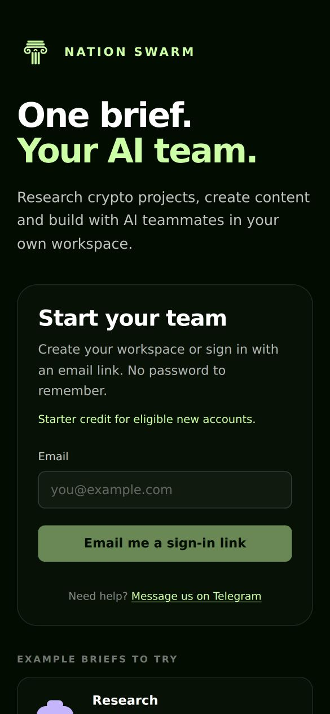
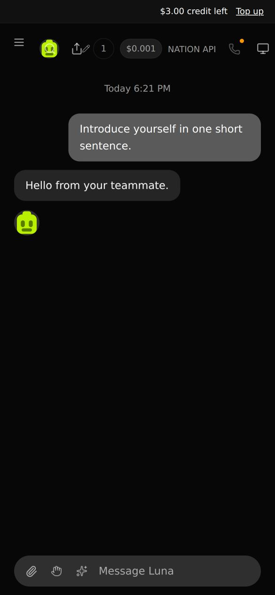
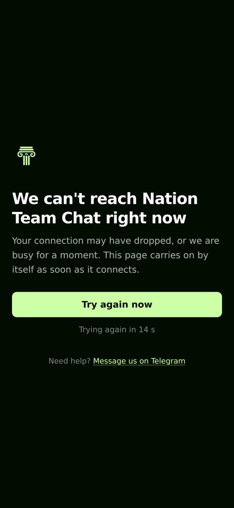
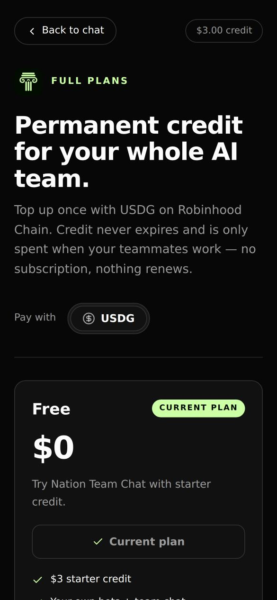

# Ad visitor journey — 27 September 2026

A dated fixture run of what a person arriving from a paid social ad meets at
thenation.city/swarm: the signup page on a phone, the emailed link, a first
reply from their teammate and Top up, plus what they see when the API errors,
hangs or a deploy lands mid-visit. It follows the
[signup landing record](paid-acquisition-2026-09-27.md). The live site was only
read; nothing was sent to it.

## Setup

- The production build (`vite build`, base `/swarm/`) behind a loopback copy of
  the production edge: only `/swarm`, `/swarm/*` and `/admin` reach the app, as
  on thenation.city, then this repository's `vercel.json` redirects and
  rewrites, evaluated after the filesystem with path-to-regexp as the web host
  does. API requests were forwarded to the fixture with
  `X-Forwarded-For/Proto/Host`, so no browser was ever the loopback owner.
- The real server through `launchVerificationServer`'s `accounts` option: sign-in
  mail in the fixture's outbox, starter credit, the loopback Robinhood Chain in
  `server/testing/fake-robinhood-chain.ts` and a loopback stand-in model.
- Headless Chromium at 390 px with a Facebook in-app browser user agent, 150 ms
  round trips, 1.6 Mbps down and a 4× CPU slowdown for the first visit; 1440 px
  for the desktop check.
- Faults injected at the edge: `/api/auth/session` answering a bare 502 or never
  answering, and the workspace chunk missing after sign-in.
- The harness was a session-local script, not a `control-omb` command.

## Checks — the build that was live, then this branch

| Check | Live build | This branch |
| --- | --- | --- |
| Signup form on the throttled phone | 1.6 s, about 100 KB | 1.4 s, about 100 KB |
| While the app loads | blank page | loading indicator |
| Email link, confirm, workspace opens | pass, 5–6 s | pass, 5–6 s |
| A new account sends its first message | composer disabled | reply in under 1 s |
| Top up | `/subscription`, the city site's 404 | `/swarm/subscription`, Full Plans |
| API answers 502 on the first visit | empty workspace: "Connecting to the bot server… Start it with pnpm dev:server" | "We can't reach Nation Team Chat right now", retried; signup appears by itself once the API recovers |
| API never answers | blank page, indefinitely | loading indicator, the same message after 10 s, signup once it recovers |
| A missing `/swarm/assets/` file | 200 with the HTML page | 404 |
| Workspace code gone after a deploy | blank page (module MIME error) | one reload, then "This page didn't load completely" with Reload |
| Tour and teammate images | `/bot-faces/…` outside `/swarm/`: 404 | served under `/swarm/` |
| Link previews | no image | 1200×630 card (`og:image`, `twitter:image`) |
| 390 px without horizontal scrolling | pass | pass, signup and workspace |

| Signup | First reply | API unreachable | Top up |
| --- | --- | --- | --- |
|  |  |  |  |

## Found on the way, and fixed

- **A new account could not send its first message.** On its first load the
  server creates the account's conversation with its teammate and announces the
  bot twice: before the conversation is claimed, when the account sees no
  thread (`threadId: ""`), and again once it is (`viewerActiveThread` in
  `server/index.ts`). Both frames arrive while the page's first snapshot is in
  flight and replay on top of it. The reducer took the change to and from the
  empty thread for a switch to another conversation and waited for a
  transcript that never comes for a server-side switch, so the composer stayed
  disabled until a reload. A change to or from an empty thread no longer waits
  (`src/state/store.tsx`); switches between two conversations are unchanged.
- **Top up led to a 404.** thenation.city forwards only `/swarm/*` and `/admin`
  to this app, so every Top up and Add credits link to `/subscription` reached
  the city site. Full Plans is now linked under the app's base; `/subscription`
  still renders it wherever it reaches the app.
- **The first page trusted the API to answer.** The session check had no deadline
  and treated a gateway error like a session, opening a workspace that could not
  load. It now gives up after 10 s, a browser that cannot reach the server says
  so and retries (the desktop app keeps its own startup screen), the sign-in
  options are asked for twice before falling back to access codes, and a page
  whose code fails to load reloads once, then explains.

## Unit tests

`src/main.test.ts`, `src/lib/session.test.ts`,
`src/pair/ServerUnavailable.test.ts`, `src/components/NationCredits.test.ts`,
`src/components/Avatar.test.ts` and `src/state/store.test.ts` cover the changes
above; each new test fails without its source change. The rest of the frontend
suite fails the same 81 tests on main and on this branch, mostly mocks that lack
newer exports; none are new.

## What this does not prove

- Delivery and inbox placement of real sign-in mail; the sender domain's SPF,
  DKIM and DMARC records were not checked.
- Production API latency; the timings are a throttled loopback fixture's.
- Receipt of advertising measurement, which is unchanged and opt-in.
- Links already shared to thenation.city/subscription still reach the city
  site's 404; a redirect there to `/swarm/subscription` would keep them working.
- Nothing reaches visitors until this build is deployed and served at
  thenation.city/swarm.

## Smoke after the deploy

1. On a phone, open https://thenation.city/swarm/ and check the signup page, then
   paste the address into a chat app and check the preview card.
2. Sign up with a new address, open the emailed link, Continue, and send your
   teammate a message: it answers.
3. Tap Top up: Full Plans opens at thenation.city/swarm/subscription.
4. Open https://thenation.city/swarm/assets/missing.js: 404.
