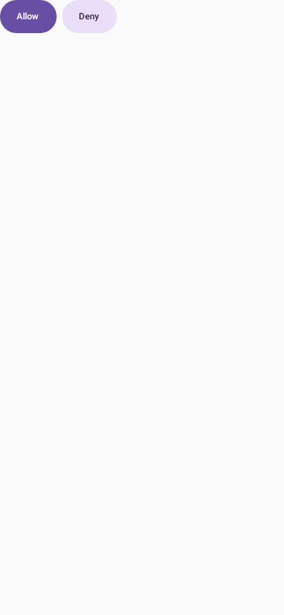
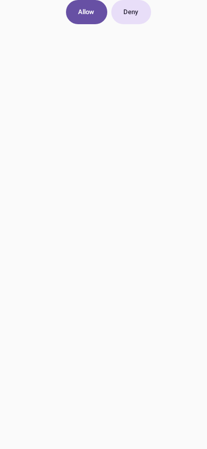
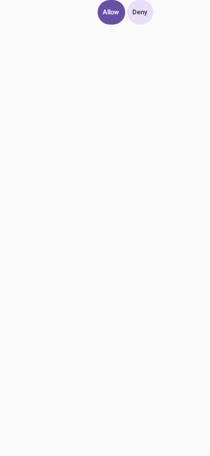

# Android approval layout (MOCA-163)

Settings → Chat → Approval buttons offers Standard, Right-aligned and Compact.
The phone-local choice applies to the approval actions in Updates and survives
relaunch. Standard preserves left alignment. The other layouts align to the
trailing edge; Compact reduces horizontal padding while retaining full labels
and at least 48 dp touch targets. Long choices wrap instead of overflowing.

Verify with the disposable Robolectric Compose fixture:

```sh
cd android
./gradlew :app:testDebugUnitTest --tests '*ApprovalLayoutTest' --tests '*ChatPreferencesTest' --tests '*ApprovalAnswersTest' --tests '*UpdatesTest'
./gradlew :app:assembleDebug
```

`ApprovalLayoutTest` measures the real buttons, checks alignment and wrapping,
and clicks the original Allow answer. `ApprovalAnswersTest` covers the existing
request/standing-grant path; `ChatPreferencesTest` checks durable settings and
unknown-value fallback. Set `OMB_UI_EVIDENCE_DIR` to an absolute directory to
save the component fixture screenshots. These screenshots use MaterialTheme;
they are layout evidence, not a physical-device or whole-Updates-screen run.

| Standard (existing alignment) | Right-aligned | Compact |
| --- | --- | --- |
|  |  |  |
