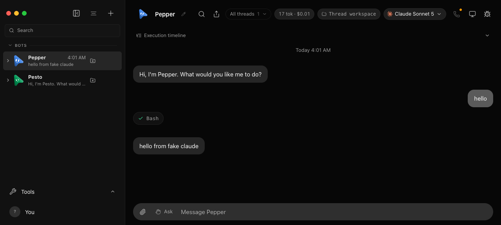

# Chat UI, driven headlessly

The `ui` group of `control-omb` drives the real React renderer — the same
`<App/>` the desktop shell loads, mounted by `scripts/testing/threads-preview.tsx`
— in a headless Chrome through the agent-browser binary the harness pins
(`server/browser-engine-release.ts`, implementation in
`scripts/testing/control-omb-ui.ts`). Everything it touches is disposable: the
fake-engine fixture from `launch`, a Vite preview of the app, and one browser
session whose `HOME` is the fixture's data directory. The user's app on port
8799 and `~/.openmausbot` are never involved.

## Launch

```sh
node --experimental-strip-types scripts/control-omb.ts ui launch \
  --tool-calls '[{"name":"Bash","input":{"command":"echo hi"},"ok":true}]'
```

Run it in the foreground so Ctrl-C reaches it. On first use it downloads the
pinned agent-browser release (size and SHA-256 verified) and its Chrome for
Testing into `.omb-scratch/verify-tools` (gitignored); later launches reuse
them. `OMB_AGENT_BROWSER_PATH` and `AGENT_BROWSER_EXECUTABLE_PATH` take
precedence when set. The launcher then starts the fixture, pins its language
to English (`PATCH /api/config`), creates Pepper through the same `new-bot`
path as [Chat turns](chat-turns.md), mounts the preview, opens it in a headless
session named `omb-ui-<port>`, and prints a handle:

```json
{
  "ok": true,
  "ui": "/tmp/openmausbot-verify-data-XXXXXX/ui.json",
  "url": "http://127.0.0.1:PORT",
  "previewUrl": "http://127.0.0.1:5178/__threads.html",
  "botId": "…", "dataDir": "…", "logPath": "…"
}
```

`--tool-calls` and `--mode` script the fake engine (`FAKE_CLAUDE_TOOL_CALLS`
and `FAKE_CLAUDE_MODE` in `server/testing/fake-claude-cli.ts`). Pass `ui.json`
to every other verb as `--ui`; there is no discovery, so a recipe cannot drive
a browser it did not launch.

## Drive

```sh
H=/tmp/openmausbot-verify-data-XXXXXX/ui.json
pnpm control:omb ui flag --ui $H --set features.showToolCalls=true --dry-run
pnpm control:omb ui flag --ui $H --set features.showToolCalls=true
pnpm control:omb ui snapshot --ui $H --interactive
pnpm control:omb ui type --ui $H --name "Message Pepper" --text hello
pnpm control:omb ui press --ui $H --keys Enter
pnpm control:omb ui wait-settle --ui $H --timeout 60
pnpm control:omb ui snapshot --ui $H
```

`snapshot` returns the accessibility tree with `@eN` refs and a `refs` table
of accessible names and roles. `click` and `type` take `--ref @eN` or the
exact `--name`, and refuse an ambiguous name by listing the candidates. `flag`
patches server feature flags (`PATCH /api/config` with `features`); the
renderer picks the change up over SSE. `wait-settle` succeeds only when the
shared `wait` tool reports the seeded bot settled, no bot in `GET /api/bots`
is busy, the transcript shows the newest server message (its `data-mid` row)
and the browser reports network idle; on timeout it exits non-zero with the
last state it saw.

Expected: the interactive snapshot has exactly one `textbox "Message Pepper"`.
After the turn, the `log "Conversation with Pepper"` landmark contains
`StaticText "hello"`, a `StaticText "Bash"` tool chip (the scripted call) and
`StaticText "hello from fake claude"` (the fake engine's reply). The chip is
present only because `showToolCalls` is on; the sidebar row previews the reply
too, so read the transcript landmark, not the whole tree.

## Evidence

```sh
pnpm control:omb ui screenshot --ui $H --out .omb-scratch/verify-evidence/chat-ui.png
pnpm control:omb ui console --ui $H
pnpm control:omb ui eval --ui $H --js "document.title"
```

Keep the `wait-settle` JSON, both snapshots, the screenshot and the printed
server log path. The console output must contain no `error` entries.

What the screenshot looks like when the recipe passes (`evidence/chat-ui/chat-ui.png`):



The permanent form of this recipe is `scripts/testing/control-omb-ui.e2e.test.ts`:

```sh
OMB_UI_E2E=1 pnpm exec vitest run scripts/testing/control-omb-ui.e2e.test.ts
```

The asserted recipe now also covers the floating Verify card with a successful,
failed, and dry-run command. Those tool outcomes are **simulated provider
events**, not executions of the commands written in the chips. Separately, the
recipe runs a real fixture health check and verifies that clicking a deliberately
missing control fails. The Verify card remains collapsible; the old execution
timeline is no longer shown above chat.

For activity detail, click **Inspector → Run Log**. It shows the selected
conversation's recorded commands, statuses and timestamps; command previews
may be shortened. **Events** and **Raw** retain the underlying technical views.
The recipe checks tab switching and saves `run-log.png` alongside `chat-ui.png`.
**Copy redacted run log** copies only the displayed activity (up to 200 entries),
not chat text or raw protocol data. Review copied logs before sharing: automatic
redaction is best effort. Neither this log nor a successful command proves an
unasserted user outcome.

It runs when an agent-browser binary resolves and is skipped with a printed
reason otherwise; `OMB_UI_E2E=1` forces the verified download. The `ui-smoke`
job in `.github/workflows/ci.yml` runs it on Ubuntu 24.04 and uploads the
screenshot; it is not one of the required checks.

## Cleanup

Interrupt `ui launch` with Ctrl-C. It closes the browser session (waiting
until agent-browser no longer lists it), then the preview, then the fixture,
and removes only its data directory; the server log stays at the printed path
and the tools directory keeps the downloads. Every verb refuses a handle whose
launch has stopped.

## What this proves, and what it does not

Proven: the real composer sends a turn on Enter, the fixture runs the scripted
fake-engine turn, the transcript renders the sent text, the tool chip and the
reply, and a server-side feature flag reaches the renderer live — all in a
Chromium page, through accessibility names, with no mouse coordinates.

Not proven: the Electron shell (menus, preload bridge, screen capture,
dictation), a real provider, Settings, sidebar drag-and-drop, the VM modal, the
browser panel and updater UI, and anything `Show threads` gates (that toggle is
renderer localStorage, outside `ui flag`). `AGENT_BROWSER_HEADLESS=1` is set
for consistency with the harness, but agent-browser 0.37.0 is headless by
default and reads `AGENT_BROWSER_HEADED` to opt out.
