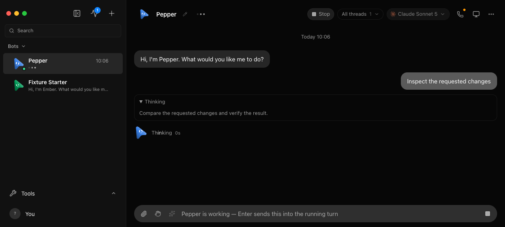

# Desktop thinking display (MOCA-181)

Desktop consumed provider reasoning deltas but never rendered their text.
Busy direct conversations and rooms now show an initially collapsed Thinking
disclosure when their selected thread has reasoning. It disappears when the
turn settles. It uses the existing translated Thinking label, shows plain text,
keeps the most recent 12,000 characters, and does not announce streamed tokens
to screen readers. Providers that emit no reasoning get no empty disclosure.

The shared renderer applies on Windows, macOS and Linux. This was verified on
macOS with a disposable server and Chromium; a packaged Windows GUI was not run.

```sh
pnpm exec vitest run src/components/ChatView.controls.test.ts src/components/GroupView.test.ts src/components/LiveReasoning.test.ts
OMB_UI_E2E=1 OMB_UI_EVIDENCE_DIR=.omb-scratch/thinking pnpm exec vitest run scripts/testing/thinking-timer-ui.e2e.test.ts -t 'discloses live reasoning'
```

The regression in ChatView failed before the implementation because the
provider's thinking text was absent. The end-to-end test sends through the real
renderer and isolated server, holds the fake provider with a file gate, expands
the disclosure, releases the turn, and checks it disappears with no browser
console errors. The new `FAKE_CLAUDE_THINKING` fixture variable provides synthetic
reasoning only in hang mode. No live account, model, or user data is used.


