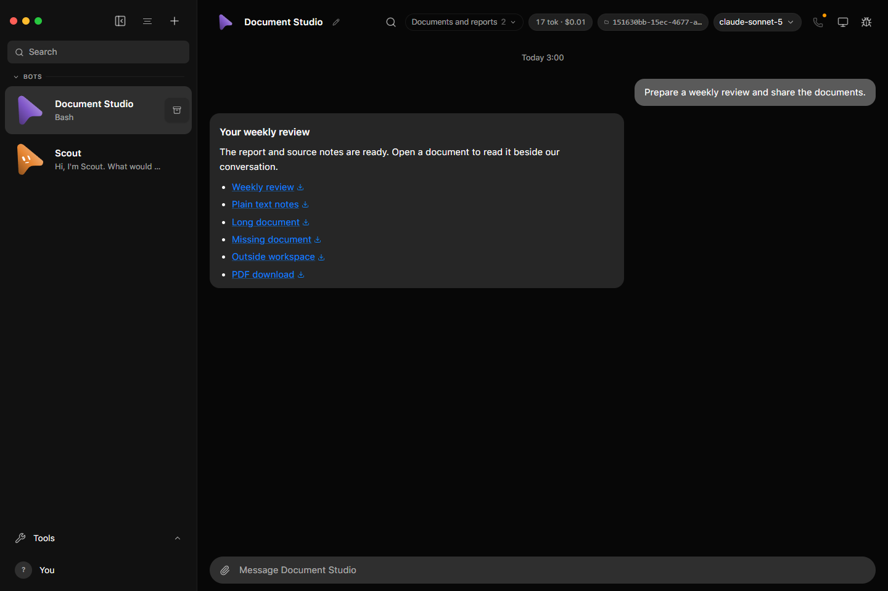
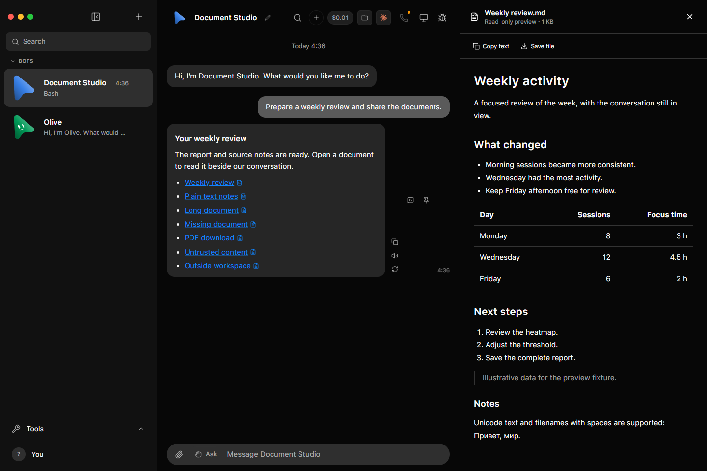
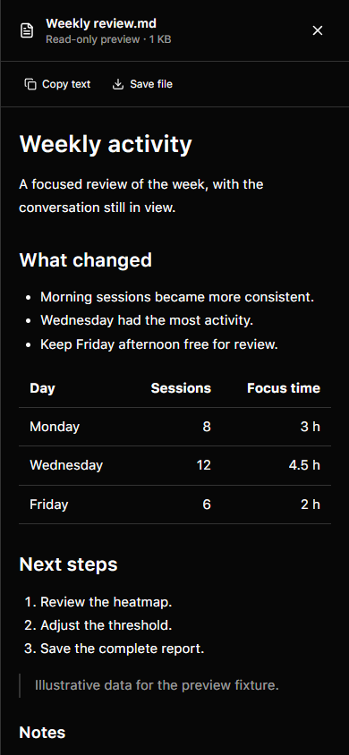

# Document preview

## UI evidence

Screenshots from an isolated fake-provider conversation:

| Before | Desktop preview | Narrow preview |
| --- | --- | --- |
|  |  |  |

File links in desktop/web conversations open a read-only document panel.
The conversation remains visible when enough space is available. Below 900 px
of available conversation space, the reader becomes a dismissible dialog.
Escape closes it and restores focus to the file link. Changing tasks closes
the reader without remounting the conversation.

## Access and file formats

`POST /api/threads/:thread/messages/:message/file` accepts `preview: true`
alongside the existing `path`. Both preview and download first validate the
exact stored message and its existing roots, then use `openMessageFile`.
The preview reads at most 256 KiB from that authorised handle and closes it
even on error. The original 25 MiB file limit remains in effect.
Preview responses preserve download's private/no-store policy, CDN-specific
no-store headers, legacy no-cache hint and authorization variation. The real
HTTP test asserts those headers alongside the existing access refusals.

Markdown and UTF-8 text (txt, log, csv, tsv, json, yaml) are readable. A
truncation notice distinguishes copying the preview from saving the complete
file. Empty files, missing files, denied paths, disconnected servers and
unsupported encodings have explicit states. PDF, office, HTML and binary files
are download-only. Rendering PDF or office formats is deferred: those require
additional parsers and a separate verification and maintenance commitment.

Document contents do not execute HTML or scripts. Nested images and links
are rendered as text, so opening a document never fetches remote resources or
creates additional local file capabilities.

A valid-looking link can still be denied when an agent saves a report in the
system temporary directory while the task is pinned to a project or worktree.
This is an access-boundary failure, not a reason to permit arbitrary disk
reads. Agent guidance now says to copy deliverables into the task folder or
the author's own workspace before linking them. The existing null/undefined
pinned-folder semantics and symlink protections are unchanged.

## Reproduce with isolated data

Start the fixture directly in a terminal:

```sh
node --experimental-strip-types scripts/document-preview-fixture.ts
```

It uses the shared `control:omb` launcher and mapped chat operations, checks
the exact child PID, configures only a scripted fake CLI, and prints its URL,
bot ID, transcript and persistent log path. It includes text, a long report,
missing/outside paths, a PDF and untrusted embedded content. No real provider
account or live app data is used. Ctrl-C closes its owned server and removes
its temporary data.

Set `OMB_PORT` to the printed port before starting `pnpm dev` in another
terminal. Open **Document Studio**, then **Weekly review**. Check a wide window
and a 390 px window, Copy text, Save file, Escape, task switching and reload.
The long document must scroll and save in full; outside and missing links must
remain unreadable; untrusted content must make no external requests.

Automated coverage:

```sh
pnpm exec vitest run server/document-preview.test.ts server/message-file.test.ts server/workspace.test.ts src/components/ChatMarkdown.test.ts
pnpm exec vitest run server/index.test.ts -t "previews a document with the same"
```

The file helper tests cover encoded spaces, Windows/UNC identities, worktree
containment, symlink escapes, invalid encodings and bounded reads. The real
server test verifies both the preview response and rejection of unshared or
out-of-root targets. Renderer and packaged-app evidence is recorded separately
because a successful server test does not prove a usable reader.
