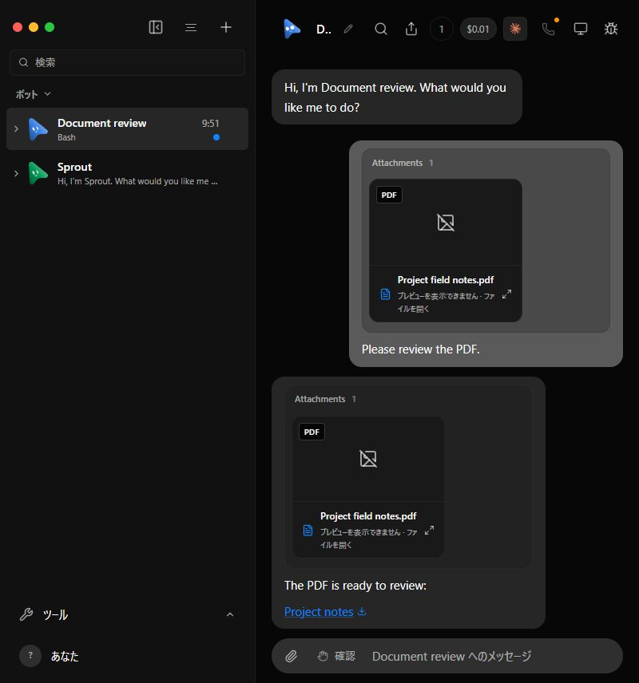
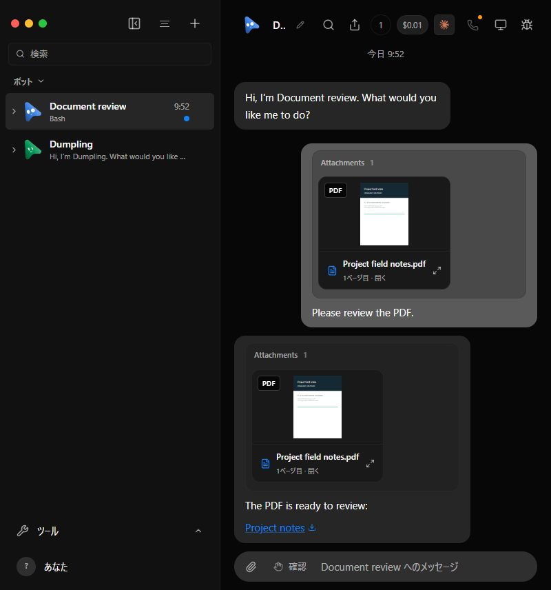
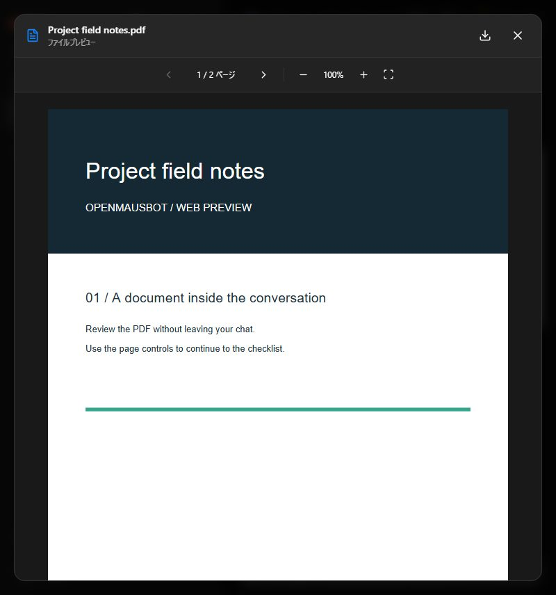
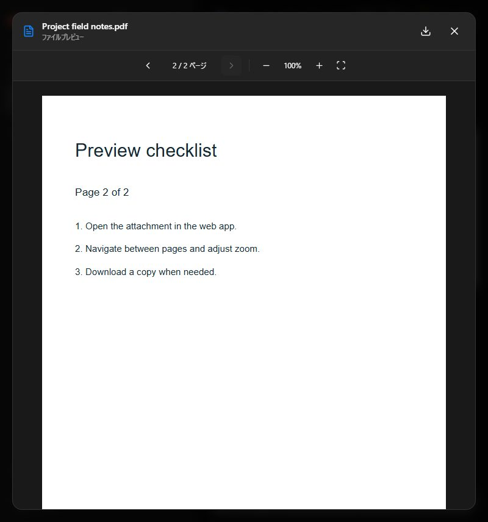

# Inline previews on current upstream main

Captured on 2026-09-12 against `milind-soni/OpenMausBot` main `2f91c462`.
The after build is `d76d50d8`, with the preview proposal merged onto that base.
The before worktree contains only copied synthetic fixture helpers, not the
production preview changes. Both fixtures use temporary homes and fake engines.
The baseline rejects video uploads and uses its default fake response.

| Before | After |
| --- | --- |
|  |  |

| PDF page 2 | Spreadsheet Checks sheet |
| --- | --- |
|  |  |

| PowerPoint slide 2 | 390px viewport |
| --- | --- |
|  |  |

## Observed behavior

- PDF, XLSX, PPTX, PNG, and MP4 badges appear at the top left, 8px inside
  thumbnail containers (9px including the image gallery border).
- Bot links render the PDF first page, spreadsheet cells, first slide, image,
  and video poster. Uploaded document cards use the same preview components.
- Both videos start paused at 0.1s, readyState 4. Clicking the bot video play
  control yields `paused: false`, `currentTime: 0.231424`, `controls: true`.
- PDF page 2, the workbook's Checks sheet, and slide 2 are accessible through
  their controls. Markup in a spreadsheet cell remains literal text.
- At a 390 by 844 viewport, document scrollWidth is 390; closing the slide
  preview returns focus to the originating file button.

## Commands and checks

```sh
pnpm install --frozen-lockfile
pnpm build
pnpm lint
pnpm i18n:check
pnpm exec vitest run src/lib/file-preview.test.ts src/lib/preview-queue.test.ts src/components/AttachmentPreview.test.ts src/components/ChatMarkdown.test.ts server/attachments.test.ts server/message-file.test.ts server/file-preview.e2e.test.ts server/control-omb.test.ts
pnpm exec vitest run src/lib/load-file-preview.test.ts
node --experimental-strip-types scripts/verify-file-preview.ts --built
```

Build (including both TypeScript checks), lint, and locale validation pass.
Focused tests: 152 passed, one failed. The failure is the existing symlink
containment test: Windows rejects symlink creation with EPERM. Running
`server/message-file.test.ts` on unmodified `2f91c462` reproduces the same failure
(15 passed, one failed). The security assertion is retained.

`pnpm broker:test` passes eight tests. `pnpm test:packaged-server` boots the
packaged harness without node_modules, checks all 12 proxy paths, and verifies
the MCP stdio handshake. `pnpm test:electron` reports 162 passed, two failed,
10 skipped: both failures require POSIX `mv` in the AppImage updater tests.
The unchanged baseline's updater file reproduces both failures (seven passed,
two failed, one skipped). No Electron implementation files are changed here.
Both browser fixture launchers reported `cleaned: true` after being stopped.

The full `pnpm test` run and current CI results are recorded in the PR; this
focused result is not a claim that the full suite passes. Machine-specific
fixture transcripts and logs stay local. See the earlier
[modal verification](../file-preview/README.md) for the original proposal's
Japanese PDF, invalid PDF, download, and video-playback evidence.

## Review fixes on 2026-09-12

Commits `47368c26` and `0cf173f5` address explicit fixture reply precedence,
committed thumbnail callbacks, metadata-ready video playback, and bounded
actual ZIP inflation. The dependency `fflate@0.8.3` was already transitive and
is now direct so the preview can use its streaming inflater explicitly.

Before these fixes: [existing capture](after.jpg). After the fixes:


The production fixture again rendered PDF, spreadsheet and slide thumbnails.
Clicking the inline video yielded `paused: false`, `currentTime: 0.236221`,
native controls enabled, and zero dialogs. The workbook's Checks sheet and
PowerPoint slide 2 still rendered. The owned fixture reported `cleaned: true`.

`pnpm build`, `pnpm lint`, and `pnpm i18n:check` pass. The following focused
command passes all 99 tests in eight files, including actual-byte overflow
rejection for both Office parsers, stored-entry mismatches, declared budgets,
normal compressed/stored ZIPs, and explicit replies overriding parent replies:

```sh
pnpm exec vitest run src/lib/file-preview.test.ts src/lib/office-preview-limits.test.ts server/file-preview.e2e.test.ts src/lib/load-file-preview.test.ts src/lib/preview-queue.test.ts src/components/AttachmentPreview.test.ts src/components/ChatMarkdown.test.ts server/control-omb.test.ts
```

The full cross-platform checks run in upstream CI; the earlier full local
suite limitations above are retained rather than represented as passing.

## Upstream integration (2026-09-13)

Merged upstream `536b7893` without rewriting the PR history. The only textual
conflict was the fixture launcher signature. Upstream `room` and `extraProviders`
remain the sixth and seventh arguments; preview `fakeReplies` moves to the eighth
argument, with both preview callers updated. Explicit replies still override
inherited fake replies. No production preview component required conflict edits.

Validation: frozen-lockfile install, production build, 99 focused tests in eight
files, lint and locale catalog checks passed. A fresh disposable production
fixture rendered PDF/XLSX/PPTX/PNG/MP4 thumbnails, PDF page 2, workbook Checks with
literal HTML text, and slide 2. Inline video played on click (paused=false,
time=0.225504, controls=true). The fixture closed with cleaned=true.

Compare the prior `review-after.jpg` with `merge-after.jpg` for the real chat
before and after upstream integration; the new upstream composer is retained.

The CodeRabbit docstring-coverage warning remains an advisory documentation
metric, not a failed executable check. Existing parser limits and cleanup are
documented in code and the verification guide. The old CLA comment does not
apply: the current proposal changes no enterprise files.


### Upstream integration and documentation review (2026-09-13)

Integrated upstream `f8cbc562` in `01b60c05`. The Box fixture endpoint remains
argument 8 and preview replies move to argument 9; both preview callers were
updated. The lifecycle test retains upstream failure evidence and graceful IPC
cleanup. English preview strings and upstream canvas strings are both retained.

Validation after integration:

- Typecheck, production build, and lint passed.
- 166 focused tests passed; the remaining local message-file symlink test failed
  with Windows EPERM during setup. Its assertion is retained for CI.
- An additional 18 archive-limit and locale-generator tests passed.
- The complete API file passed 208 tests with one existing skip (295.46 seconds).
- The real team-lifecycle fixture and original UI launcher case passed. The new
  upstream OpenRouter fixture exposed another SIGINT cleanup call on Windows;
  the shared IPC fix and a rerun are required before calling that check green.
- Updated 23 stale Ukrainian translations and their source hashes in `b585d59c`;
  locale checks pass for all 10 languages. Native-speaker human review was not
  performed locally.

`06bc9c08` adds JSDoc describing request identity, authority, buffer/URL ownership,
parser budgets, cancellation, and queue release obligations. CodeRabbit must
recompute coverage after push; the prior 31.11% warning is not yet cleared.
The final integrated head still requires fresh cross-platform CI and review.


The shared IPC repair `c96581b8` was incorporated as `90aee291`. The previously
failing OpenRouter UI case then passed alone (33.80 seconds), including clean
exit zero and fixture-data removal. The other case was excluded by the test-name
filter; it passed in the preceding run. New canvas/shared-computers fixture
verification is coordinated with the shared test-repair task.


### Integrating the upstream attachment gallery

Upstream `f073be30` introduces message-level attachment galleries. The integration
keeps those collections and places preview cards inside them. Direct/group chat
Markdown keeps its download links but does not render duplicate cards. Standalone
Markdown retains inline previews. Legacy files and the upstream M4V fallback keep
their existing explicit download/load behavior. MIME handling keeps AVIF, BMP,
and all four upstream video types without duplicate switch cases.

- [Before: upstream gallery fixture](gallery-before.png)
- [After: gallery with preview cards](gallery-after.png)
- [390px layout](gallery-mobile.png)

The before image uses the upstream chat-polish fixture at `f073be30`; the after
images use the preview fixture with synthetic PDF/XLSX/PPTX/image/video assets.
They demonstrate the respective layouts, rather than identical message content.
Both use the real renderer and disposable fake-engine servers.

Observed in the production preview build: PDF page 2, spreadsheet Checks sheet
and literal HTML cell text, slide 2, and video advancing from a paused 0.1-second
poster frame to its 3-second end after a click. All five extension badges appear.
The chat Markdown contains zero duplicate preview cards. At width 390 the document
scroll width is 390, and no browser console errors were recorded. Preview downloads
remain available in each document dialog.

Typecheck, production build, lint, and 10-language locale checks pass. The gallery
and Markdown suites pass 54 tests, including the new no-duplicate regression.
The changed gallery expectations now assert preview/play actions and extension
badges while retaining count, lazy image, no-video-at-SSR, and no-filesystem-URL
assertions. The real server/driver and tool-summary suites pass 320 tests with
two existing skips. The preceding ten-file focused run passed 139 tests and failed
the old gallery-label expectation plus local Windows symlink creation; the gallery
expectation was updated for the new UI and rechecked, while the security test is
retained unchanged for CI.

The production preview fixture reports `cleaned: true`. The comparison launcher
lost writable stdin; automatic approval review rejected manual cleanup, so that
local cleanup is not claimed complete. No live app or user data was used.

### Windows shared-computer timeout investigation

CI run `34763170650` at `7c6ad382` passed on Ubuntu and macOS. Windows
reported 6,335 passing tests and one failure in the explicit-edit/terminal
shared-computer scenario: its MCP client stopped waiting after 15 seconds.
The old error did not identify which operation was pending. The same failure
also appeared in the separate hierarchy PR, while local isolated reproduction
passed all four shared-computer scenarios.

The fixture now records the MCP action, elapsed time, connector state and
recent HTTP route/status events on timeout. It does not log request bodies or
credentials. All assertions and the original timeout remain unchanged; this is
diagnostic instrumentation, not a claimed root-cause fix. A local run including
shared-computer unit/end-to-end tests and team-setup tests passed all 32 tests
in 22.80 seconds. The independently reproduced team-setup starter-name
collision repair was imported from `5bf7667c` with its existing-bot protections.

The diagnostic CI run `34765229040` subsequently identified `run_command` as the
pending action; the connector remained connected and its lease calls returned
HTTP 200 every second. A disposable Windows runner isolated PowerShell startup
from command/module execution:

| Windows probe | Observed result |
| --- | --- |
| Original production `sharedCommand` | Still pending at the 12-second probe deadline |
| Original environment with script-entry marker | Entered at 220ms, stalled at `echo` |
| Direct .NET console output (no cmdlet) | Completed at 219ms |
| Adding only `WINDIR` or only `COMSPEC` | Still pending at each 10-second deadline |
| Adding only `PSModulePath` | `echo` and process exit completed at 570ms |

[Original Windows probe](https://github.com/Sunwood-ai-labs/OpenMakiBot/actions/runs/34767172079).
The repair retains `PSModulePath` in the Windows shell environment; the allowlist
continues to exclude provider credentials and startup-injection variables.
At the repair commit, production and MCP timeouts remained unchanged.

[Repaired Windows probe](https://github.com/Sunwood-ai-labs/OpenMakiBot/actions/runs/34767370035)
completed the actual repaired `sharedCommand` at 4,073ms on a fresh runner and
passed all eight shared-access Node tests, including real terminal cancellation
and environment-boundary assertions. Its unchanged raw baseline still stalled,
while adding `PSModulePath` completed at 265ms. Local validation passed the same
eight Node tests plus nine shared-computer unit/end-to-end tests, typecheck and
lint. The separate diagnostic branch/workflow stays out of the upstream PR.
The full three-OS PR CI still needs to confirm the repair in the entire suite.

### Upstream coordination and locale integration

Upstream `ab66e55f` includes #1166 (self-owned thread authorization and
coordination provenance) and #1164 (removing 23 stale Ukrainian translations).
The refreshed translations and their matching hashes are retained here; the
locale checker passes all ten catalogs against 2,105 English strings.

The upstream `comms` and `thread-aware-bots` suites are retained, while the
previous ACP coordination and legacy-capability scenarios move to dedicated
test files. Both paths remain covered; the ordinary-chat refusal now targets a
teammate and checks the self-owned-thread capability separately. Direct
coordination, steer queue, shared computers, gallery and Markdown validation
passed 90 tests. Typecheck, lint and production build pass.

The first seven-suite coordination run passed 64 tests with one existing
macOS-only skip, failed five legacy-helper prompt assertions, and lost the
`comms` worker unexpectedly on local Node 24.15.0. The helper was corrected to
retain the prompt restriction and assert `OMB_OWN_THREAD_CREATION=1` instead;
all ten legacy cases then passed. Repeating the full `comms` file with Node
24.20.0 passed all 27 cases in 52.67 seconds. Together these runs cover the
final seven-suite set: 87 passing cases and the existing macOS-only skip.

The full HTTP API run on local Node 24.15.0 encountered native process exits:
the first run cascaded into 123 failed tests, and the second recorded exit
`3221226505` (`0xC0000409`) before cascading into 93 failures. The first affected
routine case passed alone. Exit diagnostics were added without changing any
assertion. Repeating the full API suite with CI's Node 24.20.0 passed 208 tests
with one existing skip in 311.81 seconds, without unhandled errors. That runtime
was downloaded from nodejs.org and checked against its published SHA-256.
This comparison does not claim to identify the underlying Node 24.15.0 native
crash; no application assertion was relaxed to absorb it.

### Upstream v0.1.77, sharing gate, and diagnostic review

The next integration takes upstream `e586c224` (#1165, #1167 and the Preferences
menu). Its shared-computer feature stays disabled by default; fixture opt-ins,
local/remote withdrawal cancellation, protected-folder filesystem identities,
and the newly refreshed Ukrainian translations are preserved. The Windows
`PSModulePath` fix and the real-writer `0600` assertions remain intact.

Upstream #1165 independently changed the MCP test deadline to 40 seconds to
allow a legitimate 30-second command plus transport. This merge accepts that
contract while retaining diagnostics that exclude credentials, command text
and file content. It is separate from the earlier PowerShell repair, which was
already verified inside the original 15-second deadline on a Windows runner.
CI retains the complete suite and 45-minute Windows / 35-minute other-OS job
budgets; no test is removed, skipped or weakened by this integration.

On Node 24.20.0, nine targeted Vitest files finished with 215 passing cases and
one failure: the existing registry-symlink case could not create a file symlink
on this local Windows account (`EPERM`). All other cases, including the six
shared-computer end-to-end cases and the real-writer permission assertion,
passed. The symlink assertion is unchanged and still runs in CI. Shared-access
and preload Node suites passed 19 cases with one existing filesystem-dependent
Unicode-normalization skip. Production build (including typecheck), lint and
all ten locale catalogs passed.

The full API suite on the v0.1.77 integration passed 208 cases with one existing
skip in 308.31 seconds on Node 24.20.0, without unhandled errors. This run began
before the following diagnostic-listener-only review edit; its focused lifecycle
check and typecheck/lint were repeated after that edit.

CodeRabbit review `5191359077` correctly noted that the API fixture's diagnostic
must wait for piped stderr to close. The listener now uses `close` rather than
`exit`, preserving the nonzero-exit and SIGTERM/SIGINT filters and message.
The focused API lifecycle run passed its selected routine case (208 other
cases filtered by the command, not disabled in source).

Commands for this integration (using the verified Node 24.20.0 binary first
on PATH):

```sh
node node_modules/vitest/vitest.mjs run server/shared-computers.e2e.test.ts server/shared-computers.gate.test.ts server/config.test.ts server/environment.test.ts server/remote-sessions.test.ts server/team-computers.test.ts server/drivers/agents-proxy.test.ts src/lib/feature-flags.test.ts electron/menu.test.mjs
node --test electron/shared-computer-access.node-test.mjs electron/preload.node-test.mjs
node node_modules/vitest/vitest.mjs run server/index.test.ts
node node_modules/vitest/vitest.mjs run server/index.test.ts -t 'reports a failed routine'
pnpm build
pnpm typecheck
pnpm lint
pnpm i18n:check
git diff --check
```

### Complete Windows repair confirmation and next upstream integration

Head `58e88ced` completed [CI run 34769120750](https://github.com/milind-soni/OpenMausBot/actions/runs/34769120750)
with all ten jobs successful, including the full macOS, Ubuntu and Windows
pipelines, renderer smoke, native builds and Ubuntu packaging. The separate
build/typecheck/lint and contributor checks also passed. CodeRabbit reviewed
that exact head in run `ba3ebb26-01cb-4e50-a38d-e75e7f364d24`, with no actionable
findings and all seven threads resolved. Vercel authorization and the docstring
coverage advisory remain separate outstanding checks.

The Windows job passed 6,379 Vitest cases (206 existing skips and one todo),
including all six shared-computer E2E cases and all ten registry cases. Thus
the local file-symlink `EPERM` limitation did not recur on the runner. Broker
tests passed eight cases; Electron Node tests passed 194 with zero failures;
the packaged server started and all twelve spawned proxy paths resolved. The
`PSModulePath` repair is now confirmed in the complete Windows pipeline.

While that run was completing, upstream advanced to `b2f6e9d0` with timezone-aware
cron schedules and owned Windows CUA hosts. Only the adjacent `croner` and
`fflate` manifest/lockfile entries conflicted; both dependencies are retained.
The frozen-lockfile install passed. Fifteen related Vitest files passed all
371 cases, covering scheduler/parser/API/proxy/export behavior, calendar labels,
Windows CUA isolation, capabilities and preview detection. Build, typecheck,
lint and locale validation passed.

The new upstream cron UI fixture initially tried to click Tools before React
had rendered the sidebar. A snapshot diagnostic run passed; replacing that
timing side effect with an explicit accessible-name readiness poll also passed
the complete UI case in 32.55 seconds. The fixture now uses the existing IPC
stop protocol on Windows and asserts exit code zero and removal of its own
temporary data directory. All original UI assertions remain, including custom
cron preservation, call exclusions and no browser-console errors. The final
fixture run and subsequent typecheck/lint passed. The new Windows native-host
smoke is retained in upstream's CI workflow; it was not run locally.

These integration results do not transfer the earlier head's full CI or review
approval to the next pushed head. Fresh complete CI and review remain required.

```sh
pnpm install --frozen-lockfile --ignore-scripts
node node_modules/vitest/vitest.mjs run server/routine-cron.e2e.test.ts server/routine-requests.test.ts server/routines-startup.test.ts server/routines.test.ts server/bot-package.test.ts server/package-export.test.ts server/drivers/agents-proxy.test.ts shared/routine-schedule.test.ts src/components/routines/cron-editor.test.ts src/lib/routine-calendar.test.ts src/lib/schedule-label.test.ts src/lib/local-computer.test.ts electron/capabilities.test.mjs electron/cua-windows-isolation.test.mjs src/lib/file-preview.test.ts
# With OMB_UI_E2E=1 and Node 24.20.0 first on PATH:
node node_modules/vitest/vitest.mjs run scripts/testing/cron-routines-ui.e2e.test.ts --silent=false
pnpm build
pnpm typecheck
pnpm lint
pnpm i18n:check
```

### Windows terminal and caption-button upstream integration

Head `bef44712` subsequently completed all twelve Actions checks, including
[full CI 34770746341](https://github.com/milind-soni/OpenMausBot/actions/runs/34770746341).
Windows passed the staged CUA native-host smoke, 6,462 Vitest cases (207 existing
or configuration-dependent skips and one todo), eight broker cases, 194 Electron
cases with zero failures, and packaged-server smoke. Its browser-dependent cron
UI case was skipped by the existing CI configuration; the explicit local run
above passed. CodeRabbit covered that exact head without actionable findings.

Upstream `0ddb4194` then added #1169 terminal semantics and #1134 Windows caption
buttons. The terminal merge retains upstream's built-in-module priority, encoded
original command, nested CLI output/exit behavior and process-tree cancellation.
The environment helper now preserves both Windows `PATHEXT` and `PSModulePath`,
while its regression still excludes credentials and startup-injection variables.
Both ChatView and GroupView retain gallery ownership of previews without duplicate
Markdown cards after the automatic caption-button merge.

The new upstream built-in-module test initially failed because `SystemRoot` was
spelled `C:\\WINDOWS`, while PowerShell returned `C:\\Windows`. Running the unchanged
upstream implementation reproduced the same failed string-prefix check, although
both paths resolved to the same directory. The assertion now resolves the first
module-path entry and compares the complete directory, preserving its priority
requirement and also excluding similarly prefixed sibling paths.

With Node 24.20.0, shared-access/preload Node tests passed 21 cases with one
existing filesystem-normalization skip, including original command syntax,
native exit codes, pipeline output and actual inner-shell cancellation. Ten
related Vitest files passed all 108 cases, including real shared-computer E2E,
gates, caption capabilities, chat controls and galleries. Build/typecheck, lint,
and all ten locale catalogs (2,109 English strings) passed. The added upstream
shared-terminal smoke workflow retains read-only repository permissions and
the real connector regression. Fresh CI/review must cover the merged head.

```sh
node --test electron/shared-computer-access.node-test.mjs electron/preload.node-test.mjs
node node_modules/vitest/vitest.mjs run server/shared-computers.e2e.test.ts server/shared-computers.gate.test.ts electron/capabilities.test.mjs electron/window-chrome.test.mjs src/components/ChatView.controls.test.ts src/components/ChatView.verify.test.ts src/components/BotIdentityAvatars.test.ts src/components/RoutineResultsNavigation.test.ts src/components/AttachmentGallery.test.ts src/components/ChatMarkdown.test.ts
pnpm build
pnpm lint
pnpm i18n:check
git diff --check
```

### Production server `.mjs` MIME type for the PDF.js worker (2026-09-19)

Review finding on `PdfPreview.tsx`: the built-in production server's MIME map in
`server/index.ts` had no `.mjs` entry, so the hashed `pdf.worker.min-*.mjs` asset
was served as `application/octet-stream`. Browsers reject module scripts with
that type, so PDF thumbnails and the dialog both failed. `17635064` maps `.mjs`
to `text/javascript`; `server/index.test.ts` ("serves packaged UI assets and
preserves API 404s") now requests a `.mjs` asset and asserts that type.

The earlier `verify-file-preview.ts --built` runs did not catch this: they served
`dist/` through Vite's own `preview` server, which already knows `.mjs`, not the
app's `serveStatic`. This check serves the production `dist/` through the real
`server/index.ts` (`OMB_STATIC_DIR`) on a disposable data directory with the fake
engine, then drives headless Chrome at 800 by 856. For the before capture only the
single `.mjs` line was removed from the working tree, then restored to the
committed state.

| Before: worker served as `application/octet-stream` | After: worker served as `text/javascript` |
| --- | --- |
|  |  |

| Dialog, page 1 of 2 | Dialog, page 2 of 2 |
| --- | --- |
|  |  |

Before: both PDF cards show the broken-image placeholder and the "preview
unavailable" caption, and the console records three `Failed to load module
script ... "application/octet-stream"` errors. After: both cards render the first
page, the dialog navigates from page 1 to page 2 through the worker, and the
console records no errors. Both fixtures reported `cleaned: true`. The fixture and
capture scripts were local scratch files and are not part of this PR.
