# File preview evidence

Captured on Windows in the Codex in-app Chromium browser, September 9, 2026.
Every conversation and file came from disposable fake-engine fixtures. The
comparison base is upstream commit `32fa0d070832f4706e051da889561b13813ced54`.

## Before and after

Before: PDF, workbook, and presentation cards offered only Save a copy.

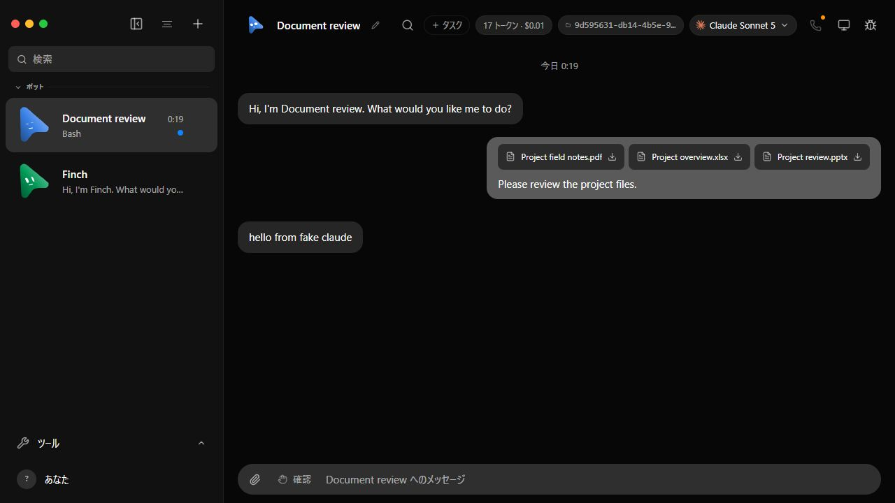

After: supported attachments offer Open preview. The video is also accepted by
the composer and server; baseline did not accept that upload MIME type.

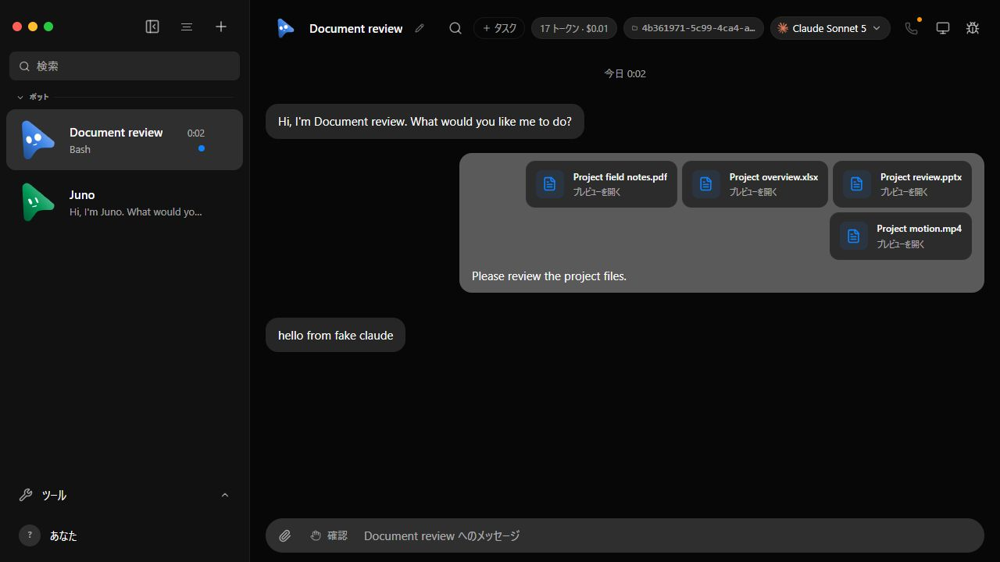

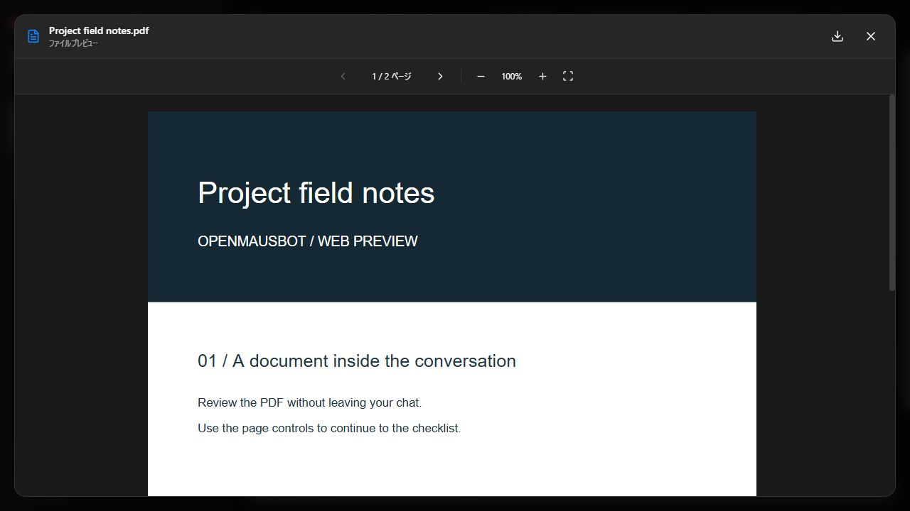

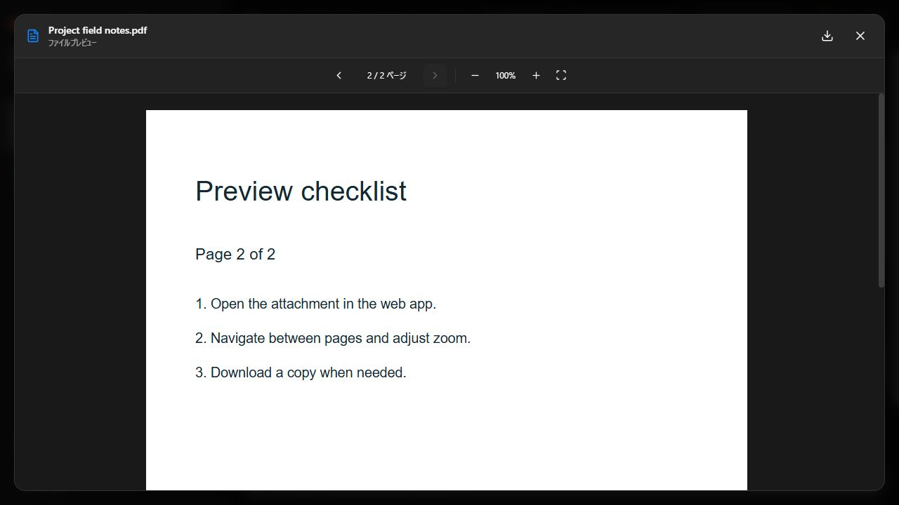

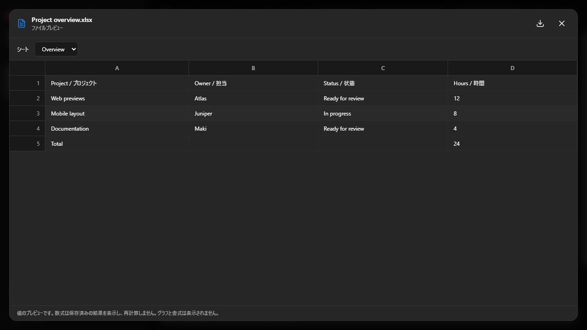

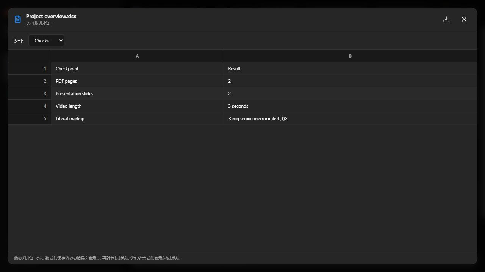

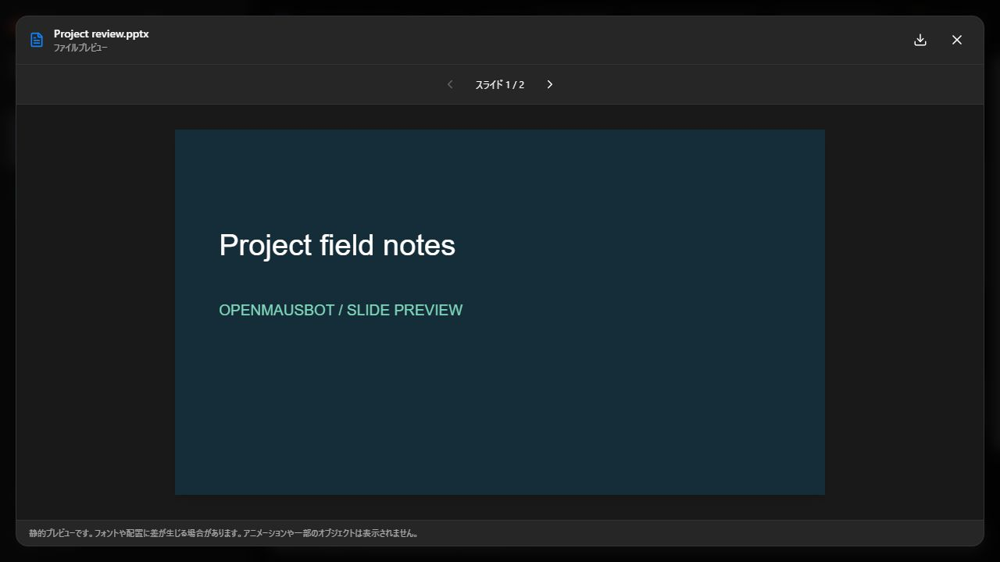

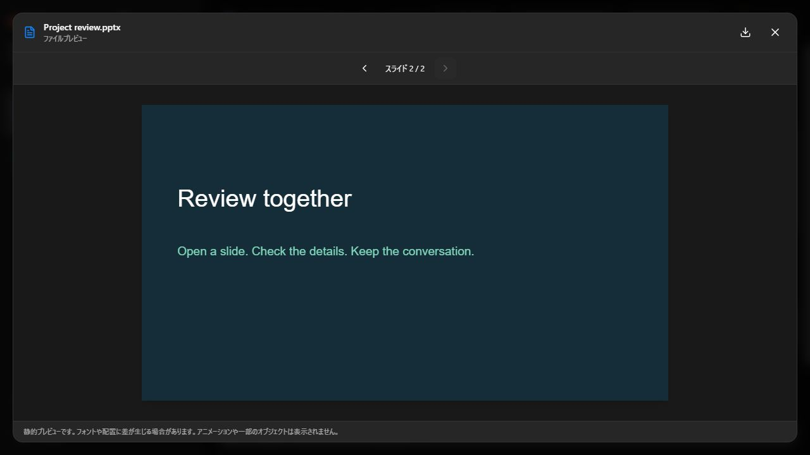

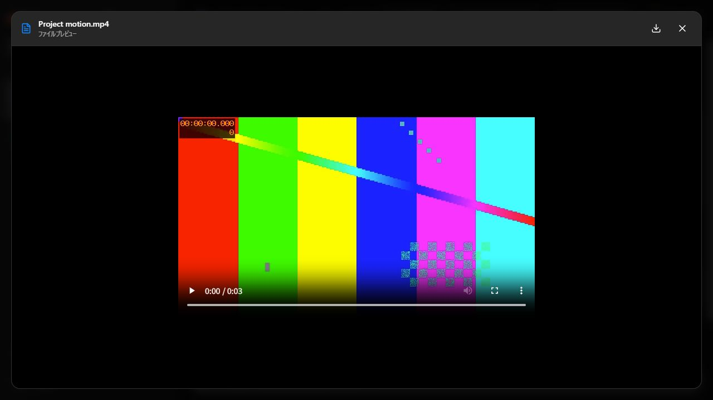

The animation below consists of actual browser screenshots taken during
playback, encoded as a GIF. Playback time was observed advancing, and the final
production build was also checked with `paused: false` and `currentTime > 0`.

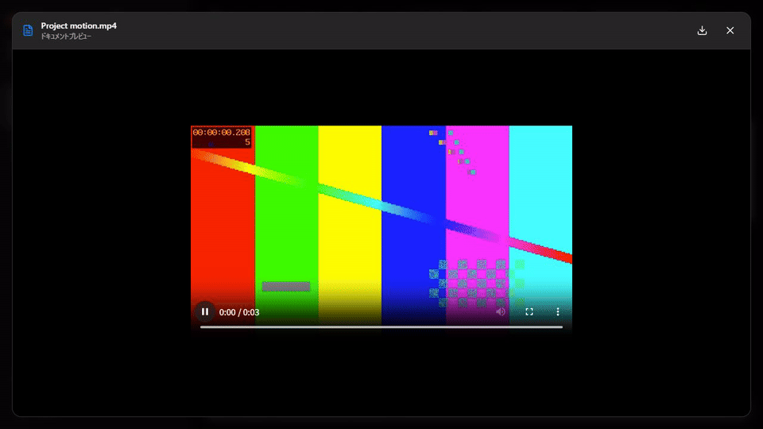

## Japanese, narrow screens, and errors

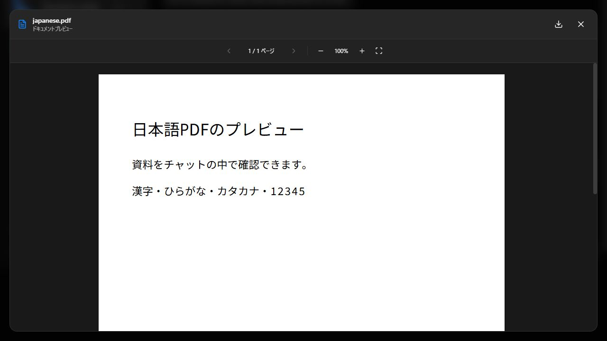

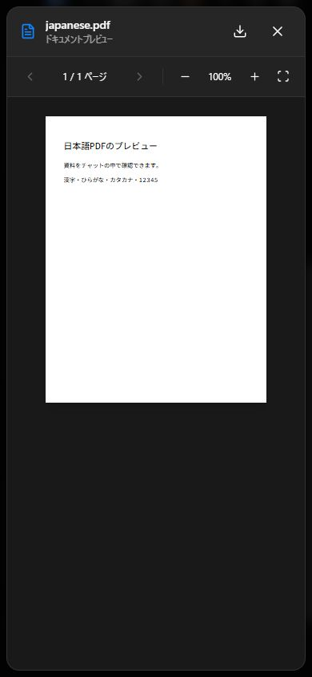

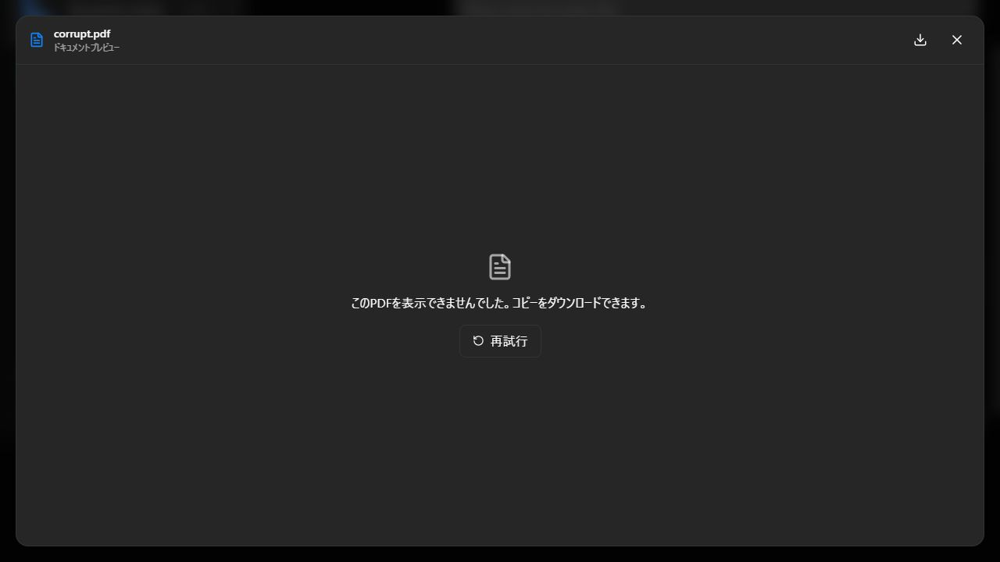

The malformed file was retried and returned to the error state; closing restored
focus to its file button. The app root became inert while the dialog was open.
PDF, workbook, slide, and video rendering were checked again against `pnpm build`
output. The Japanese/mobile/error screens and animated recording were captured
before the final subtitle wording changed from Document preview to File preview.

The PDF download link was clicked, but the browser automation did not deliver a
download event. The authenticated API test separately verified exact original
bytes and MIME types for all four formats; local OS save completion is not claimed.

## Validation

- Production build, including renderer/server type checking: passed.
- Focused preview suite: 5 files, 73 tests passed.
- Control launcher suite: 11 tests passed. One concurrent preview fixture startup
  exited early without a log; a standalone rerun of its API test passed.
- Broker tests: 8 passed.
- Packaged server: passed (startup with no node_modules, proxy paths, MCP stdio).
- Locale catalogs: all 8 valid. Targeted lint and `git diff --check`: passed.
- Full Windows Vitest run: 4,347 passed, 81 failed, 130 skipped, 1 todo.
  Unchanged base: 4,297 passed, 90 failed, 130 skipped, 1 todo, and one worker
  error. All 81 implementation failure names also occur at the base commit;
  no implementation-only failure was found. This comparison does not turn
  either failed run into a passing suite. See [the comparison record](test-comparison.json).
- Electron tests: 138 passed, 2 failed, 6 skipped. Both failures reproduced at
  the base commit: Linux AppImage updater tests require the unavailable `mv` command.

Full-suite failures are not waived and a clean local `pnpm test` is not claimed.
The full run preceded final display-name/label and import-extension fixes;
the production build and focused checks were rerun after those fixes.
The full logs and fixture action/result JSON are retained locally beside these
screenshots but excluded from commits because they include machine-specific paths.

Reproduction commands and supported-format limitations are in the
[verification recipe](../../file-preview.md).
