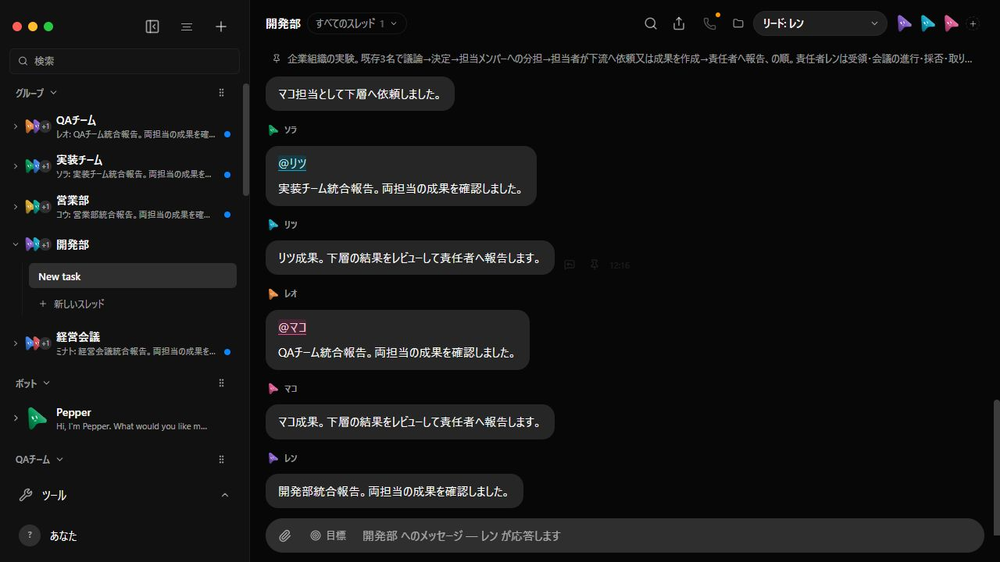
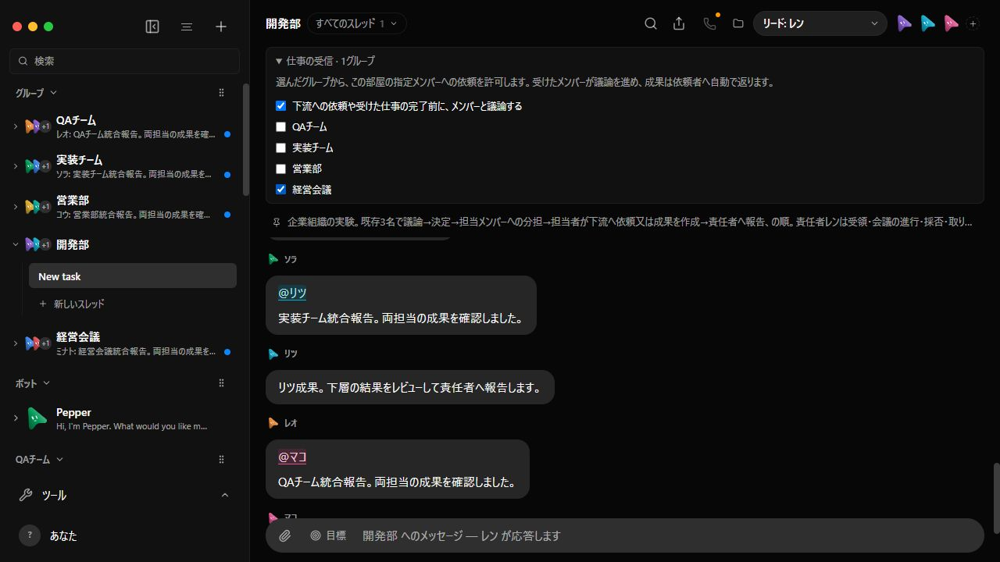

# Room hierarchy evidence — 2026-09-12

Upstream comparison base: `2f91c462926bee70242c42a4e3443b19d0a13a0c`.
Proposal: [#1124](https://github.com/milind-soni/OpenMausBot/issues/1124).

A subsequent [live Claude Code / GLM-5.3 run](live-2026-09-12/README.md) on this
same upstream base completed all five groups and records the real discussions,
generated artifacts, screenshots and unresolved acceptance findings. The record
below remains the earlier deterministic scripted run.

The run uses an isolated `launchVerificationServer` fixture, the real server,
the real injected agents MCP proxy, and scripted provider responses. The React
screenshots show the resulting persisted conversations. No live application data
was used. This is **not** a fresh GLM-5.3 run or a semantic acceptance test of CSV
output. In particular, the scripted leaf replies are placeholders for work, not
the promised production artifacts.

## Recorded workflow

| Layer | Group / chair | Existing responsible members | Downstream destination |
| --- | --- | --- | --- |
| 1 | Executive / ミナト (Minato) | アオイ (Aoi), ユイ (Yui) | Development / Sales |
| 2 | Development / レン (Ren) | リツ (Ritsu), マコ (Mako) | Implementation / QA |
| 2 | Sales / コウ (Kou) | サキ (Saki), トワ (Towa) | Local execution |
| 3 | Implementation / ソラ (Sora) | ヒナ (Hina), ナギ (Nagi) | Local execution |
| 3 | QA / レオ (Leo) | メイ (Mei), ハル (Haru) | Local execution |

Five groups, fifteen bots, seven discussion rounds, ten member assignments, five
work nodes and forty-five provider turns were recorded. Every node reached
`completed`. Assertions check that downstream requests belong to the assigned
member, later speakers receive earlier opinions, results return to the requesting
member and chair, and group membership remains unchanged.

The chair proposes and decides in the same group. Assigning a member does not
create a new organizational layer. The return path is data plus a continuation;
it does not send another work request to the downstream recipient.

## UI comparison

The **before** image uses the unmodified upstream renderer from the comparison
base against the **same completed fixture data**. It demonstrates the UI delta,
not successful pre-change execution of this workflow. The **after** images use
the feature renderer. Screenshots are unmodified browser captures at 1280 × 720.

| Before: group view without incoming-work controls | After: explicit incoming route and required discussion |
| --- | --- |
|  |  |

The Development incoming route was unchecked in the UI, observed as zero routes
after a reload, and checked again. The saved setting returned to Executive-only.
The required-discussion setting remained checked. No browser console errors were
reported for the inspected feature page.

## Each group's discussion and return

| Group | Discussion | Assignment/results |
| --- | --- | --- |
| Executive | [Proposal, concerns and revision](executive-discussion.png) | [Reviewed returns and final report](executive-results.png) |
| Development | [Incoming request and first discussion](development-discussion.png), [second round and decision](development-decision.png) | [Returns to Ritsu and Mako, then Ren](development-results.png) |
| Sales | [Incoming request and discussion](sales-discussion.png) | [Member assignments and report](sales-results.png) |
| Implementation | [Incoming request and discussion](implementation-discussion.png) | [Member assignments and report](implementation-results.png) |
| QA | [Incoming request and discussion](qa-discussion.png) | [Member assignments and report](qa-results.png) |

[transcripts.json](transcripts.json) preserves the text messages, synthetic
identities, tree edges, participants and terminal states without machine paths,
credentials, or private configuration. [sha256.txt](sha256.txt) records the exact
image and transcript hashes.

## Interpretation and reproduction

Run the [three-layer recipe](../../room-pyramid.md) to reproduce orchestration.
The [basic handoff](../../room-handoffs.md) and
[discussion](../../room-discussion.md) recipes cover refusal, cancellation and
ordering behavior. The PR records the separate full-suite and baseline results;
these screenshots do not imply that the full suite is green.

Scripted ordering/context assertions do not measure real-model tool selection,
reasoning quality, token costs, correctness across generated artifacts, or support
across every engine. A leader can still incorrectly accept a result. The bounded
scheduler does not replace acceptance review by the leader or human.
