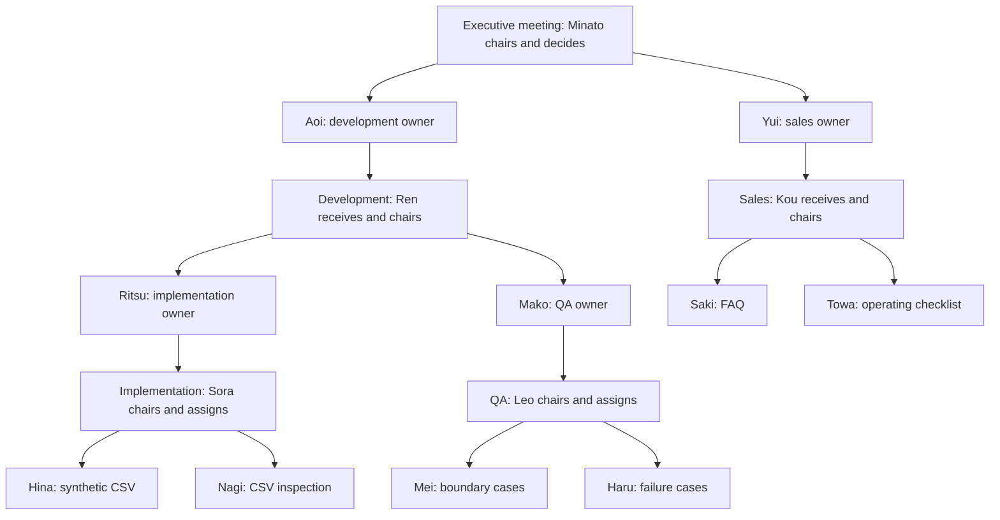

# A three-layer organization with member-owned branches

The recipient chairs a discussion with existing members, revises the proposal,
and assigns concrete responsibility with `assign_room_member`. An assigned member
then uses `send_room_message` to ask a named member of a downstream group, reviews
the returned work, and reports to the chair. Speaking in a discussion does not
implicitly start an execution assignment.



Owner boxes are members of the immediately preceding group, not additional group
layers. There are five rooms and fifteen members across three organizational
layers: Executive → Development/Sales → Implementation/QA. Membership stays fixed.
Results return through the requesting member, then to the chair.

All fifteen bots share the `検証会社` section. Sections are communication
boundaries; the three organizational layers are separate groups inside that
boundary. Incoming routes do not override section isolation.

## Reproduce

```sh
node --experimental-strip-types scripts/verify-room-pyramid.ts .omb-scratch/pyramid/verification.json
```

The shared `control-omb`/MCP surface creates an isolated fixture. Executive and
Development hold two rounds each; the other three rooms hold one round each.
Every chair assigns two existing members. Assertions cover seven discussion
rounds, ten assignments, five work nodes, member-owned downstream branches,
upstream returns, and unchanged membership. Scripted responses make this an
orchestration test; the actual server and mounted MCP proxy execute the workflow.

The [discussion recipe](room-discussion.md) describes optional Claude Code /
GLM-5.3 configuration and `--live --preview`. In that mode, model-generated CSV,
inspection tables and documents are produced in chat. The experiment does not
implement the requested application feature, validate actual CSV file bytes, or
publish anything externally. Inspect artifact consistency separately from the
orchestration assertions.

## Limits

- Assignment addresses another existing member of the same conversation after a
  successful discussion. Pending discussion prevents assignment.
- An assigned member cannot recursively assign another member of the same room;
  it executes the responsibility or asks an allowed downstream room.
- Same-room assignment does not increase cross-room depth. Ancestor-room cycles
  remain forbidden. Bounds are 4 cross-room edges, 24 child requests, 48 coordinated
  executions and a 30-minute lifetime.
- New discussion keys permit another round within those bounds. There is no
  unlimited conversation or automatic semantic agreement detector.
- A final reply is not proof of a correct decision. Compare concerns, revisions,
  owners and artifacts in the transcript and screenshots.

See [the dated evidence](evidence/room-hierarchy/README.md) for the upstream-base
comparison, screenshots and the explicit limits of the recorded run.
