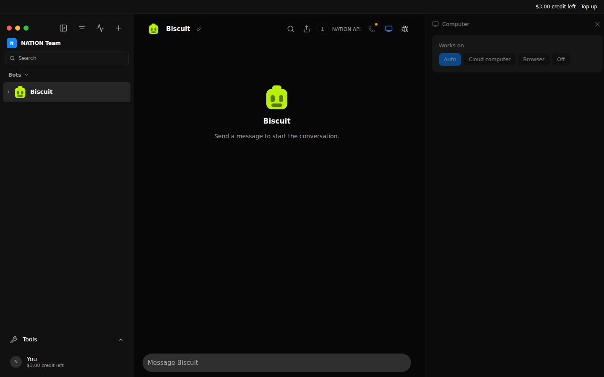
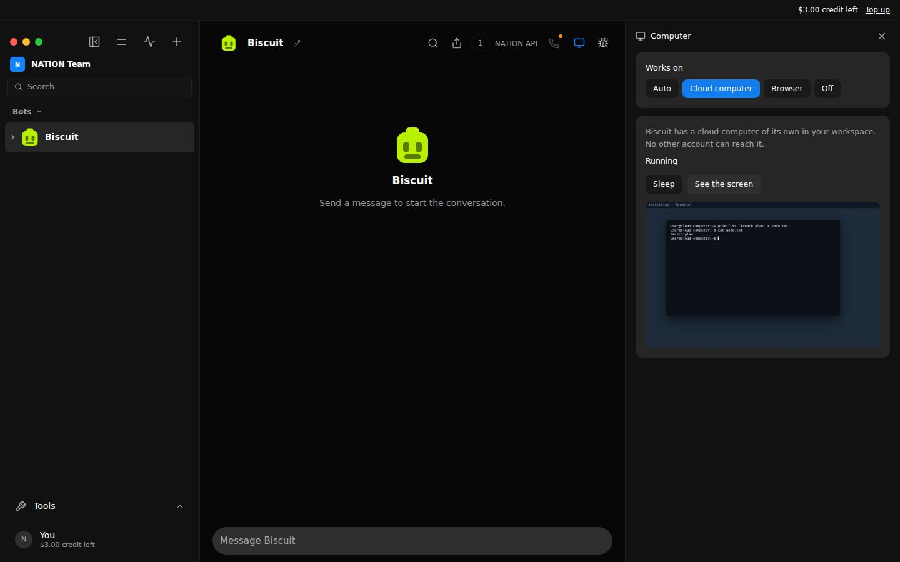
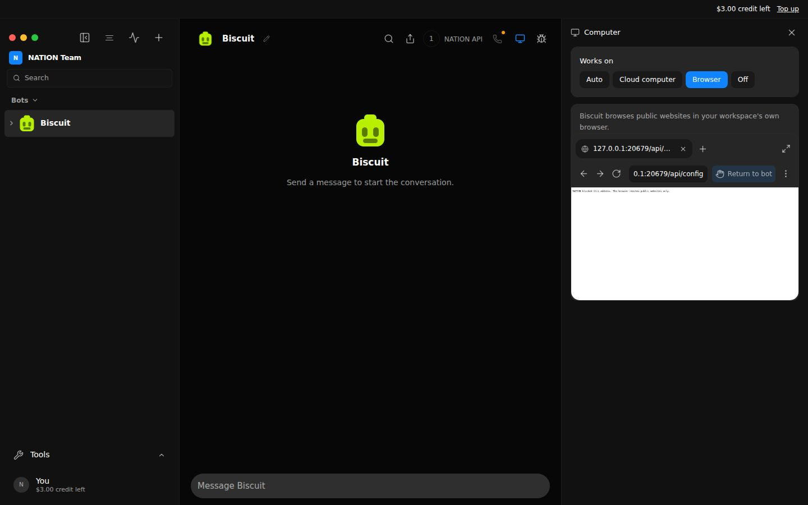
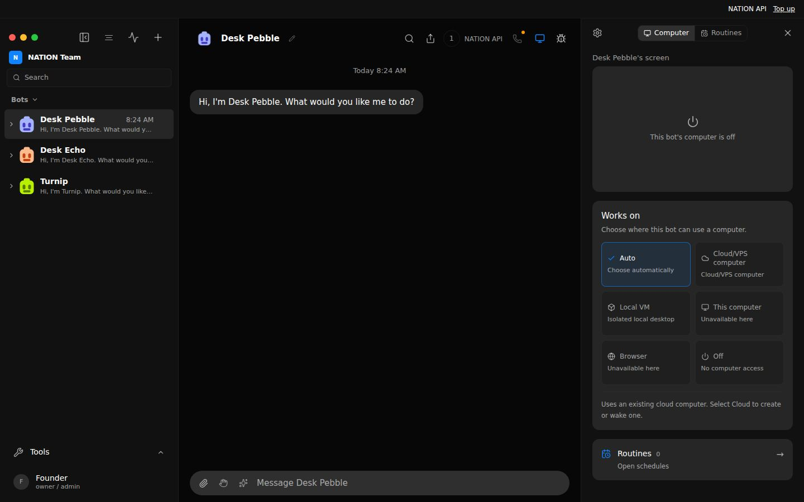
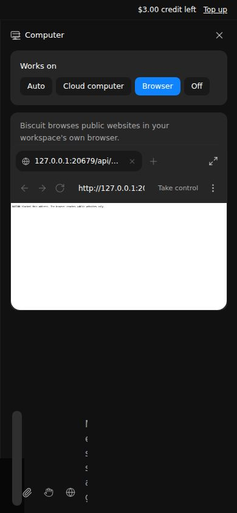

# Computers and a browser for each member workspace — 2026-09-27 record

Public sign-up gave every account its own workspace server, but a chat-only
one: its bots had no computer and no browser. This change gives each member
workspace NATION's cloud computers (one per account and bot, in that
workspace) and the built-in browser behind an egress guard, both torn down
with the workspace. The founder desk is unchanged, and pairing still adds
devices to the founder desk only.

## Public invites stay NO-GO

Public invites remain NO-GO until this change is merged, deployed, and the
check under [Check after the deploy](#check-after-the-deploy) passes on a
second email workspace (an address that is not on `OMB_SIGNIN_EMAILS`, never
the founder's own). Nothing below replaces that live check: the runs here use
stand-ins for the cloud computer provider and the model, and a real Chrome only
on this machine.

## How it works

- **Who decides.** The public server decides at each workspace start
  (`workspaceTools` in `server/workspace-host.ts`): cloud computers when it
  holds NATION's cloud computer credential (Admin, or `BOX_TOKEN`) and
  `NATION_WORKSPACE_COMPUTERS` is not `0`; the browser when its browser engine
  is ready and `NATION_WORKSPACE_BROWSER` is not `0`. The workspace's
  `config.json` gets `features.computers` and `features.browser` from that,
  `sharedComputers: false` always, and never `box`, `vps`, `localVm` or
  `browserEngine` settings. A member cannot change any of them: config,
  instances, engines and keys stay admin routes, and a workspace has no admin.
- **Cloud computers.** A remote machine per account and bot, keyed as the
  hosted per-account computers already are (`<bot>--u-<hash of the account>`)
  and named under the workspace's own installation scope, so two workspaces
  never share or even name the same machine. The credential reaches the
  workspace server through its environment only: never its `config.json`, a
  response, or an engine's command line. A member's routes act on their own
  machine, resolved from the signed-in account, never from a parameter:
  - `GET /api/bots/<id>/computer`: `{ surface, configured, state }`.
  - `POST /api/bots/<id>/computer/provision`, `.../sleep`: `{ ok, state }`.
  - `POST /api/bots/<id>/computer/screenshot`: the picture only.
  - `join`, `exec` and `remove` answer 403: no desktop link (it is the
    provider's own page and a credential) and no provider identifiers.
  - A provider failure reaches the member as one product message; the
    provider's own wording goes to the workspace server's log.
  Commands run only through the bot's own computer tools during a turn.
- **Never this machine's computers.** In a workspace the Local VM, this
  machine's desktop, SSH computers and team or shared computers are not routes
  at all (404, whoever asks), a bot cannot be set to work on them (400), a turn
  never mounts them, and a bot set to an SSH computer is moved to the cloud
  one.
- **The browser.** It runs on this machine, as the desk's does, so it is
  fenced three ways:
  - *Egress guard* (`server/browser-egress-guard.ts`): each workspace server
    starts its own loopback proxy, and Chrome sends every request through it,
    loopback included (`AGENT_BROWSER_PROXY_BYPASS=<-loopback>`), with WebRTC
    held to proxied UDP. The guard resolves the name itself and connects only to the
    address it checked, which must be public by the web reader's rule
    (`blockedAddress` in `server/nation-web-tools.ts`). So a page, a script or
    the model reaches public websites and nothing else: not the founder desk,
    another workspace, private networks or cloud metadata.
  - *Tool policy* (`server/member-browser-policy.ts`), on every call through
    `/api/internal/browser/mcp`: the 29 core tools of agent-browser 0.37.0
    only; `open` and `tab_new` take http, https or `about:blank`; `read` takes
    no url (the engine would fetch it outside Chrome, past the guard);
    `screenshot` keeps its picture inline (no file paths); no `headed` or
    page-provided tools. Anything else, such as `upload`, is refused.
  - *Its own place on disk*: the workspace's own home, and a private
    directory `/tmp/nw-<12 hex>` (mode 0700, refused if someone else made it)
    for Chrome's temporary files and the engine's sockets. It never attaches
    to another Chrome.
  The live browser panel shows the member their own session; it navigates
  only to http and https addresses, and offers no saved profiles.
- **No owner by loopback.** A workspace server started this way treats a
  request to its port without a session as nobody (401): reaching its port
  from this machine proves nothing. Its own agent tools still call
  `/api/internal/*` with their per-turn capability, which each handler checks.
- **Torn down with the workspace.** When a workspace stops (idle, making room,
  or the server shutting down) it puts its cloud computers to sleep (billing
  pauses; their disks stay) and closes its browsers, within 7 seconds. Then
  the public server stops anything still running with that workspace's private
  directory and removes it. Starting the workspace again waits until that is
  done, and first clears anything an earlier run left (if the public server
  was killed, say).
- **Founder desk.** Unchanged: its settings, its computers and its routes. It
  starts no egress guard and keeps loopback ownership.

## Found on the way, and fixed

- **IPv6 spellings of private addresses passed the address rule.**
  `blockedAddress` compared IPv6 text, so `::ffff:7f00:1` (127.0.0.1, the form
  Chrome writes), `::ffff:a9fe:a9fe` (the cloud metadata address), the fully
  expanded forms, IPv4-compatible and 6to4 addresses were public to it. On a
  host with IPv6 they reach this machine's own servers. It now compares
  addresses by value. The web reader (`web_read`) used the same rule, so this
  also closes the same gap there, which exists on main.
- **A quick restart could stop the new workspace server.** Stopping a
  workspace removed it from the running list before its process exited, so a
  request in that window started a second server on the same private
  directory, and the first one's cleanup then stopped the second. A start now
  waits for the previous process to finish.
- **Start answered with the machine's identifiers and desktop link.** The
  member's Start returned the provider's whole answer. It now returns the state
  only, and provider errors are replaced by a product message.

## Evidence

### End to end: `server/nation-workspace-computers.e2e.test.ts`

The real server with public sign-up on, three real workspace servers started
by it, and loopback stand-ins for the model, the cloud computer provider
(a separate filesystem per machine), the browser engine
(`server/testing/fake-agent-browser-core.mjs`, which records how it was
launched and every call that reached it) and Robinhood Chain. Founder, Alice
and Bob sign in by email.

| Check | Result |
| --- | --- |
| (a) Alice's workspace: `features.computers` and `browser` on, sharing off | pass |
| (a) Her bot cannot be set to the Local VM, this machine or an SSH computer (400) | pass |
| (a) Her bot saves and reads a file on its own cloud computer, named in her workspace's scope | pass |
| (a) Status, Sleep, Start and screenshot answer with state or picture only: no machine id, name or desktop link | pass |
| (a) A provider failure reaches her as the product message only | pass |
| (a) Desktop link, commands and remove are refused to her (403) | pass |
| (a) Her browser opens a web page; a file address, a `read` with a url and a picture saved to a path are refused before the engine | pass |
| (a) The engine saw exactly the calls allowed, and advertised no `upload`, `read` url or file paths | pass |
| (a) Her browser starts behind her egress guard (`<-loopback>`, proxied WebRTC only), without CDP, in her own home and `/tmp/nw-…` | pass |
| (a) That guard refuses the founder desk by `127.0.0.1`, by `localhost` and through a tunnel (403) | pass |
| (d) Bob's bot gets its own machine; it sees none of Alice's files, and Alice's machine ran none of Bob's commands | pass |
| (d) Alice's bots, computers and browser routes do not exist for Bob (404) | pass |
| (d) Bob's browser has its own home, directory and guard; nothing of his reached Alice's engine | pass |
| (c) Config writes with a computer key or sharing, new engines, engine installs, this machine's computers, team and shared computers, taking control: all refused (403 or 404) | pass |
| (c) Preferences cannot switch features (400) | pass |
| (c) Alice's workspace port answers `/api/config` and pairing with 401 without a session | pass |
| (c) The cloud computer credential appears in no member response and no workspace `config.json` | pass |
| (b) The founder desk's features, computer settings and teammates are as before, and its own computer routes still answer | pass |
| Stopping puts both members' machines to sleep and removes both private directories | pass |

### The real browser: agent-browser 0.37.0 and Chromium

A scratch run of the chain the server builds (`agentBrowserIntegration` with
the guard's launch settings, the member policy on every call), driving the
real engine and Chromium on this machine, with a stand-in desk (a page
reading `FOUNDER-DESK-SECRET`) and an allowed stand-in public site on
loopback. The control run is the same with no guard. This container runs as
root, so both runs added `--no-sandbox`; production does not.

| Step | With the guard | Control, no guard |
| --- | --- | --- |
| Open the public page | `PUBLIC-PAGE-OK` | `PUBLIC-PAGE-OK` |
| Open the desk by `127.0.0.1` | "NATION blocked this address…" | `FOUNDER-DESK-SECRET` |
| Open the desk by `localhost` | "NATION blocked this address…" | `FOUNDER-DESK-SECRET` |
| Open the desk by `[::ffff:127.0.0.1]` | "NATION blocked this address…" | not run |
| A page script fetches the desk | fails | reads `FOUNDER-DESK-SECRET` |
| Requests the desk received | 0 | 5 |
| `open file:///etc/hostname` | refused by the policy | refused by the policy |
| `read` with a url | refused by the policy | refused by the policy |
| `upload` | refused by the policy | refused by the policy |

No browser process or private directory was left after either run.

### In the app: 14 of 14 passed, no page errors

The production build (base `/swarm/`) behind a proxy that adds forwarded
headers, as the production path does, so no browser is the loopback owner; the
real server with public sign-up, the real browser engine and Chromium, and
the stand-in model and cloud computer provider. Alice signs in with an emailed
link; then the founder.

| Check | Result |
| --- | --- |
| Alice's config: computers and browser on, sharing off, engine ready | pass |
| Works on offers Auto, Cloud computer, Browser and Off | pass |
| The panel names no desk, VM, SSH computer, engine or other product | pass |
| Choosing Cloud computer saves it on her teammate | pass |
| Start runs her machine and See the screen shows its screen | pass |
| One machine, named in her workspace's scope | pass |
| Her browser is told the state only: no machine id or name | pass |
| Her live browser offers no saved profiles | pass |
| Her browser's request for the founder desk is refused by her guard | pass |
| Her live browser refuses a file address even when asked directly (400) | pass |
| 390 px: the panel fits without horizontal scrolling | pass |
| The founder signs in to the desk as admin | pass |
| The founder's Computer panel is the desk's own | pass |
| The founder desk's features are as before | pass |

| Works on | Her cloud computer |
| --- | --- |
|  |  |

| Her browser, pointed at the founder desk | The founder desk, unchanged |
| --- | --- |
|  |  |

At phone width the panel takes the whole width and the conversation behind it
is squeezed, as with the desk's own side panels; that layout is unchanged here.

### Automated tests

- `server/browser-egress-guard.test.ts`: this machine's servers under every
  name (IPv4, IPv6, mapped and expanded spellings), private networks and
  metadata refused over http and tunnels, a name with any private address
  refused, forwarding pinned to the checked address, proxy requests only.
- `server/nation-web-tools.test.ts`: the address rule for every spelling of
  an embedded IPv4 address, 6to4, NAT64, Teredo and the special ranges.
- `server/member-browser-policy.test.ts`: web addresses only, `read` without
  a url, no file writes or launch changes, unknown tools refused, the
  advertised tools, and exactly the core tool list of 0.37.0.
- `server/workspace-host.test.ts`: the switches, the credential by
  environment only, the config (never sharing, a credential or another
  Chrome), the private directory and its refusal when someone else made it,
  leftover processes stopped at teardown and a bystander left alone, an
  earlier run's leftovers cleared before a start, and a restart that waits for
  the stopping server.
- `server/request-auth.test.ts`: the member computer and browser routes exist
  only when the workspace offers them, and a workspace has no loopback owner.
- `src/components/nation-member-computers.test.ts`: a member's own workspace
  offers Auto, Cloud computer, Browser and Off as its config allows, never on
  a shared desk, and the browser panel without the owner's profiles.
- Baseline: `vitest run` over all 672 files (Node 22.22; `package.json` asks
  for 24) fails 360 tests in 101 files. The same 101 files on main
  (`c067aec`) fail 359 of them identically, test by test, and nothing fails
  only on main. The other one, the Electron case in
  `server/local-computer-proxy.test.ts`, timed out starting Electron (a 10 s
  budget) while a typecheck ran beside the suite; it passes on this branch
  when run again (2 of 2), and this change does not touch it. Among the shared
  failures, `server/workspace-child-bot-model.e2e.test.ts` fails on main too:
  a member's `/api/instances` answer is rewritten for members (`nationApi`
  becomes `nation`), which the test does not expect.

## Attack surface and what remains

- **One operating system user.** Every workspace server and browser runs as
  the server's own user; separation between them is by data directory,
  private directory, egress guard and the request gate, not by the kernel.
  A code-execution flaw in a workspace server would reach the others.
- **Chrome on this machine.** Pages from any website render here; the guard
  keeps their network to the public internet, and Chrome's own sandbox (which
  needs the server not to run as root) keeps them off the filesystem.
- **This machine's public address.** It is a public address like any other,
  so the browser reaches whatever this machine serves publicly, as anyone on
  the internet can. Keep private services on loopback or a private network.
- **Any port.** The guard does not restrict ports; Chrome's own list of unsafe
  ports still applies to pages.
- **One provider credential.** Each workspace server holds NATION's
  account-wide cloud computer credential in its environment. The server code
  only ever addresses its own machines by name, but a compromised workspace
  server could reach every machine.
- **Machine time.** A member can start their machines at will; they are put to
  sleep when the workspace stops (after 30 idle minutes by default), and the
  provider archives an abandoned machine by itself. Credits pay for model use
  only: machine time is NATION's cost.
- **Not in the founder's inventory.** The founder desk's Computers list shows
  only machines of its own installation; each workspace finds its own machines
  by name.
- **No desktop.** Members see a screenshot, not the live desktop.
- **`/tmp`.** The private directory lives in `/tmp` so socket paths stay
  short. A directory someone else created there first is refused, and that
  workspace then starts without its browser.

## Deploy settings

On the API server, in addition to the sign-up settings in the
[login and workspaces record](login-workspace-turnkey-2026-09-26.md#deploy-settings)
(see `deploy/nation.env.example`):

- NATION's cloud computer credential in Admin (or `BOX_TOKEN` in the process
  environment). Without it, member workspaces have no computers.
- `AGENT_BROWSER_EXECUTABLE_PATH` set to the exact Chrome the desk runs (see
  [the VPS guide](../deploy-vps.md)). Workspaces have homes of their own and do
  not find a Chrome installed under this server's home.
- `NATION_WORKSPACE_COMPUTERS=0` or `NATION_WORKSPACE_BROWSER=0` switch either
  off for every member workspace, from its next start.

## Check after the deploy

On the live site, with a second email address that is not the founder's and
not on `OMB_SIGNIN_EMAILS`. Record each result, with a screenshot, in this file.

1. Sign in with the second address at `https://thenation.city/swarm`; a new
   workspace opens.
2. Open a teammate's Computer panel: "Works on" offers Auto, Cloud computer,
   Browser and Off, and nothing about desks, VMs or SSH.
3. Choose Cloud computer and ask the teammate to save a note to a file and
   read it back. Start, Sleep and See the screen work.
4. Choose Browser and ask it to open a public website and summarize it. Then
   ask it to open `http://127.0.0.1:<the API server's port>/api/config`: the
   page reads "NATION blocked this address".
5. In a second private window, sign in with a third address: its teammate
   cannot see the second address's note.
6. Sign in with the founder's address: the desk and its computers are as
   before.
7. On the server after 30 idle minutes (or a restart): the log says the
   workspaces stopped, `ls /tmp | grep nw-` lists none of theirs, and the
   provider shows their machines asleep.

Public invites may open only after every step passes.
